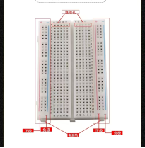
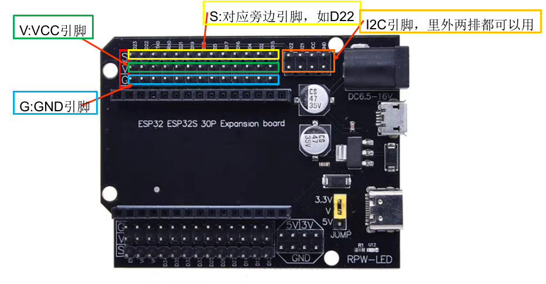
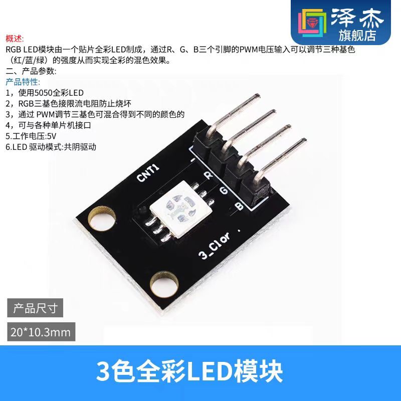
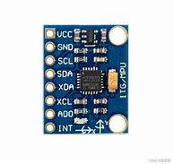
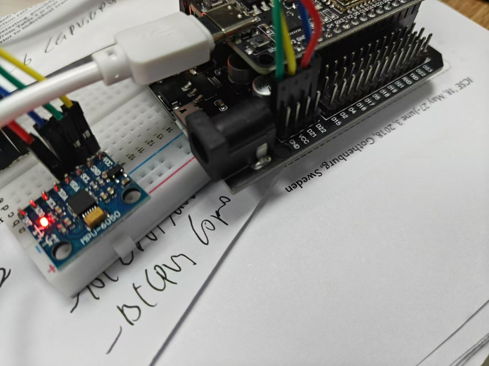

## 实验一: 基础设备控制

基础设备控制实验着眼于RIOT的多线程控制，基于GPIO引脚输出的LED灯控制以及基于I2C总线的IMU传感器数据读取。最终目标是根据设备的姿态展示不同的LED显示状态。

### 实验目标：

- 理解RIOT操作系统的多线程控制原理和方法。
- 掌握基于GPIO引脚的LED灯控制技术。
- 学习通过I2C总线读取IMU传感器数据的方法。
- 实现根据设备姿态展示不同LED显示状态的功能。

#### 面包板讲解
面包板是一种用于电子电路原型设计和测试的设备，它允许用户轻松地插入、连接和重新配置电子元件，而无需焊接。面包板的孔通常分为两行，每行中的孔是相互连接的。这意味着你可以将一个元件的引脚插入任何相邻的孔中，它们都会相互连接。具体面包板介绍，请观看视频[bilibili面包板](https://www.bilibili.com/video/BV1154y1p7ut/?share_source=copy_web&vd_source=75944587b4fe894bd6d46576127344b6)。



#### ESP32扩展版讲解
扩展版只需要注意每个引脚的含义就可以了。如下图所示，红框标注着S、V、G，分别代表信号引脚、VCC引脚和GND引脚，最外面旁标注的内容对应最外面一排的引脚(黄色边框)，中间一排是VCC引脚(绿色边框)，最里面一排是GND引脚(蓝色边框)，因此注意不要接错引脚。


### 一、RIOT-OS 多线程使用
#### (1) 程序执行
`00_threads/`提供一个基于多线程的工作调度案例，要使用线程，**需要给每个线程单独分配STACK空间**。
执行案例。
```bash
esp_idf all
# sudo chmod 777 /dev/ttyUSB*
cd ~/RIOT/examples/emnets_experiment/00_threads/
# 正常执行以下编译命令即可
make BOARD=esp32-wroom-32 flash term

# 基于容器的编译链
BUILD_IN_DOCKER=1 DOCKER="sudo docker" \
   DOCKER_IMAGE=schorcht/riotbuild_esp32_espressif_gcc_8.4.0 \
   make BOARD=esp32-wroom-32 flash
```
#### (2) 多线程介绍
下面是官方给的[基本案例](https://doc.riot-os.org/group__core__thread.html).
首先，为线程rcv_thread预先分配了堆栈内存`rcv_thread_stack`，然后实现了线程的函数`*rcv_thread`, 通过在`main()`中调用`thread_create()`来创建`rcv_thread`。它的优先级为`THREAD_PRIORITY_MAIN - 1`，即比主线程的优先级略高(优先级值越小，优先级越高)，设置为`THREAD_CREATE_STACKTEST`标志，线程会立刻执行。
```c++
// kernel_pid_t thread_create(char *stack, int stacksize, uint8_t priority,
//                             int flags, thread_task_func_t task_func,
//                             void *arg, const char *name);
#include "thread.h"
char rcv_thread_stack[THREAD_STACKSIZE_MAIN];
void *rcv_thread(void *arg)
{
    (void) arg;
    msg_t m;
    while (1) {
        msg_receive(&m);
        printf("Got msg from %" PRIkernel_pid "\n", m.sender_pid);
    }
    return NULL;
}
int main(void)
{
    thread_create(rcv_thread_stack, sizeof(rcv_thread_stack),
                  THREAD_PRIORITY_MAIN - 1, THREAD_CREATE_STACKTEST,
                  rcv_thread, NULL, "rcv_thread");
}
```
`int msg_receive(msg_t *m);`和`int msg_send(msg_t *m, kernel_pid_t target_pid);`用与两个线程之间的通信。
`msg_receive`会一直等待信息，而`msg_send`可将信息发送到指定的线程。下述为`msg_t`的结构体定义，`sender_pid`会自行定义，其余参数都可灵活用于传递信息，如通过type参数来执行不同的程序(如蓝牙发送、暂定等)。
```c++
typedef struct {
    kernel_pid_t sender_pid;    /**< PID of sending thread. Will be filled in
                                     by msg_send. */
    uint16_t type;              /**< Type field. */
    union {
        void *ptr;              /**< Pointer content field. */
        uint32_t value;         /**< Value content field. */
    } content;                  /**< Content of the message. */
} msg_t;
```
下述的部分案例当中，创建了一个用于调度的线程，在队列加入任务后，通过`msg_send`函数会提醒所有工作节点的线程。
```c++
void *scheduler_thread(void *arg) {
    (void)arg;
    int task_arg1 = 1;
    int task_arg2 = 2;
    while (1) {
        enqueue_task(task_function1, &task_arg1);
        xtimer_sleep(2);
        enqueue_task(task_function2, &task_arg2);
        xtimer_sleep(2);
        for (int i = 0; i < NUM_WORKERS; ++i) {
            msg_t msg;
            msg.content.value = 1;
            msg_send(&msg, worker_pids[i]);
        }
    }
    return NULL;
}
#define THREAD_STACKSIZE        (THREAD_STACKSIZE_IDLE)
static char stack[THREAD_STACKSIZE];
int main(void)
{
    // ....
    char scheduler_stack[STACKSIZE];
    thread_create(scheduler_stack, sizeof(scheduler_stack),
                  THREAD_PRIORITY_MAIN - 1, THREAD_CREATE_STACKTEST,
                  scheduler_thread, NULL, "scheduler");
    return 0;
}
```
RIOT OS 学会线程如何创建、线程间如何通信即可。

### 二、案例一： 多线程及LED灯控制
#### (1) LED灯设备介绍


RGB LED灯有R,G,B和I这四个引脚，I引脚接到GND引脚即可(后续如果引脚不够，可以将GND接到任意低电压的引脚，VCC接到高电压的引脚), R,G,B引脚接到GPIO引脚，根据案例,R引脚接到`D26`(`GPIO26`),G引脚接到`D25`(`GPIO25`),B引脚接到`D27`(`GPIO27`)。
#### (2) 案例运行
```bash
esp_idf all
# sudo chmod 777 /dev/ttyUSB*
cd ~/RIOT/examples/emnets_experiment/01_threads_led/
# 正常执行以下编译命令即可
make BOARD=esp32-wroom-32 flash term
# 注意每次烧写完，点击ESP32左侧reset按钮

# 基于容器的编译链
BUILD_IN_DOCKER=1 DOCKER="sudo docker" \
   DOCKER_IMAGE=schorcht/riotbuild_esp32_espressif_gcc_8.4.0 \
   make BOARD=esp32-wroom-32 flash
```
完成上述操作后，灯每隔1s会闪红灯或熄灯，如下面视频所示。


#### (3) 案例解释
请浏览`01_threads_led/ledcontroller.cpp`和`01_threads_led/ledcontroller.hh`以及`01_threads_led/main.cpp`文件，查看如何控制GPIO来控制灯状态等。如何实现线程之间通信。

```c++
// 01_threads_led/ledcontroller.cpp
// LED灯控制
LEDController::LEDController(uint8_t gpio_r, uint8_t gpio_g, uint8_t gpio_b){  
    printf("LED Controller initialized with (RGB: GPIO%d, GPIO%d, GPIO%d)\n", gpio_r, gpio_g, gpio_b);
    // Input your code
    led_gpio[0] = gpio_r;
    led_gpio[1] = gpio_g;
    led_gpio[2] = gpio_b;
    gpio_init(led_gpio[0], GPIO_OUT);
    gpio_write(led_gpio[0], 0);
    rgb[0] = 0;
} 
void LEDController::change_led_color(uint8_t color){  
    // Input your code
    gpio_write(led_gpio[0], color);
}
```
1) `01_threads_led/ledcontroller.cpp`中`LEDController::LEDController(uint8_t gpio_r, uint8_t gpio_g, uint8_t gpio_b)`完成灯引脚初始化，通过`gpio_init`将引脚R设置为输出模式，并通过`gpio_write`将引脚R输出电压调整为低电压，完成R引脚初始化。

2) `01_threads_led/ledcontroller.cpp`中`void LEDController::change_led_color(uint8_t color)`完成对灯的控制，本案例只给出对引脚R的控制，较为简单，`gpio_write(pin, value);`,对对应引脚pin设置电压，value为0，设置为低电压，value 大于 0则设置为高电压。

这两个函数后续作业会涉及，会要求实验对RGB多引脚控制，以及多种颜色显示，因此请在此处留意**如何初始化引脚，如何控制引脚状态来控制灯颜色**。

```c++
// 01_threads_led/main.cpp
// 定义RGB引脚
#define LED_GPIO_R GPIO26
#define LED_GPIO_G GPIO25
#define LED_GPIO_B GPIO27
// 定义MSG标志灯的TYPE
#define LED_MSG_TYPE_RED     (0x3111)
#define LED_MSG_TYPE_NONE    (0x3110)
void *_led_thread(void *arg)
{
    (void) arg;
    // init led controller
    LEDController led(LED_GPIO_R, LED_GPIO_G, LED_GPIO_B);
    while(1){
        printf("[LED_THREAD] WAIT\n");
        msg_t msg;
        // Wait for the message from led thread
        msg_receive(&msg);
        if (msg.type == LED_MSG_TYPE_NONE)
        {
            // TURN OFF LIGHT
            led.change_led_color(0);
            printf("[LED_THREAD]: LED TURN OFF!!\n");
        }
        else if (msg.type == LED_MSG_TYPE_RED)
        {
            // TURN ON LIGHT
            led.change_led_color(1);
            printf("[LED_THREAD]: LED TURN ON!!\n");
        }
    }
    return NULL;
}
#include "ztimer.h"
void *_sleep_thread(void *arg)
{
    (void) arg;
    uint16_t sleep_ms = 1000;
    uint8_t color = 0;
    while(1){
        // sleep 1000 ms
        ztimer_sleep(ZTIMER_USEC, sleep_ms * US_PER_MS);
        printf("[SLEEP_THREAD]: SLEEP FINISH\n");
        msg_t msg;
        color++;
        if (color % 2 == 1)
        {
            // Tell the led thread to turn on red light
            msg.type = LED_MSG_TYPE_RED;
        }
        else 
        {
            // Tell the led thread to turn off light
            msg.type = LED_MSG_TYPE_NONE;
        }
        // send the message to the led thread(_led_pid)
        if (msg_send(&msg, _led_pid) <= 0){
            printf("[SLEEP_THREAD]: possibly lost interrupt.\n");
        }
        else{
            printf("[SLEEP_THREAD]: Successfully set interrupt.\n");
        }
    }
    return NULL;
}
```
3) `01_threads_led/main.cpp`中`LEDController led(LED_GPIO_R, LED_GPIO_G, LED_GPIO_B);`创建灯控制对象并完成对引脚的初始化，`msg_receive(&msg);`和`msg.type`等待接受来自其他线程的消息，并根据`msg.type`信息作出对应决策，这个比较灵活，`msg.type`可自定义，这里案例定义`#define LED_MSG_TYPE_RED     (0x3111)`表示亮起红灯，`#define LED_MSG_TYPE_NONE    (0x3110)`表示熄灯。
4) `01_threads_led/main.cpp`中`_sleep_thread`中需要留意两点，一、如何sleep？首先引入头文件`#include "ztimer.h"`, 其次在Makefile文件中加入`USEMODULE += ztimer`, 后可直接调用`ztimer_sleep(ZTIMER_USEC, sleep_ms * US_PER_MS);`，其中`sleep_ms`为休眠时间，单位为毫秒。二、线程之间如何通信？首先创建msg`msg_t msg;`,msg_t结构体内容如下所示，这里通过`msg.type`来携带信息，最终通过`msg_send(&msg, _led_pid)`将信息发送到线程ID`_led_pid`对应线程的`msg_receive(&msg);`处。

```c++
typedef struct {
    kernel_pid_t sender_pid;    /**< PID of sending thread. Will be filled in
                                     by msg_send. */
    uint16_t type;              /**< Type field. */
    union {
        void *ptr;              /**< Pointer content field. */
        uint32_t value;         /**< Value content field. */
    } content;                  /**< Content of the message. */
} msg_t;
```
这里**如何实现线程之间的通信以及如何休眠**需要留意，这两个可以说是后续绝大多数都涉及。

```c++
#define THREAD_STACKSIZE        (THREAD_STACKSIZE_IDLE)

static char stack_for_led_thread[THREAD_STACKSIZE];
static char stack_for_sleep_thread[THREAD_STACKSIZE];
int main(void)
{
    // create led thread
    _led_pid = thread_create(stack_for_led_thread, sizeof(stack_for_led_thread), THREAD_PRIORITY_MAIN - 2,
                            THREAD_CREATE_STACKTEST, _led_thread, NULL,
                            "led");
    // create sleep thread
    thread_create(stack_for_sleep_thread, sizeof(stack_for_sleep_thread), THREAD_PRIORITY_MAIN - 1,
                            THREAD_CREATE_STACKTEST, _sleep_thread, &_led_pid,
                            "sleep");
    while(1);
    return 0;
}
```
5) `01_threads_led/main.cpp`中函数`thread_create`创建并运行两个线程，并记录`_led_thread`线程ID，留作前面`msg`通信使用。这里留意**线程如何创建**即可，线程创建格式较为固定，参考下面函数定义即可，基本上注意栈创建分配，函数名修改即可。
```c++
kernel_pid_t thread_create(char *stack, int stacksize, uint8_t priority,
                           int flags, thread_task_func_t function, void *arg,
                           const char *name);
```

#### (4) Makefile编写
```makefile
# name of your application
APPLICATION = mThreads

BOARD ?= esp32-wroom-32

# This has to be the absolute path to the RIOT base directory:
RIOTBASE ?= $(CURDIR)/../../..

# Comment this out to disable code in RIOT that does safety checking
# which is not needed in a production environment but helps in the
# development process:
DEVELHELP ?= 1
USEMODULE += shell_cmds_default
USEMODULE += ztimer
USEMODULE += xtimer
USEMODULE += cpp
# Change this to 0 show compiler invocation lines by default:
QUIET ?= 1

# Use a peripheral timer for the delay, if available
FEATURES_OPTIONAL += periph_timer

include $(RIOTBASE)/Makefile.include
```
Makefile 文件`APPLICATION`指定生成应用名， `BOARD`代表开发板型号，可编译时指定，`USEMODULE`指定需要添加的模块，这里用到`ztimer`和`cpp`模块(RIOT OS的特性，模块化开发，按需导入), `FEATURES_OPTIONAL` 指明使用一个外围设备计时器，其余保持默认即可。

#### (5) 补充:
1. 引脚模式:`int gpio_init(gpio_t pin, gpio_mode_t mode);` 初始化GPIO引脚(如`GPIO12`)的工作模式，目前支持6种工作模式，具体参考下面内容，本实验只需要通过输出电压来控制LED灯，因此设置为`GPIO_OUT`即可。
```c++
typedef enum {
    GPIO_IN    = GPIO_MODE(0, 0, 0),    /**< input w/o pull R */
    GPIO_IN_PD = GPIO_MODE(0, 2, 0),    /**< input with pull-down */
    GPIO_IN_PU = GPIO_MODE(0, 1, 0),    /**< input with pull-up */
    GPIO_OUT   = GPIO_MODE(1, 0, 0),    /**< push-pull output */
    GPIO_OD    = GPIO_MODE(1, 0, 1),    /**< open-drain w/o pull R */
    GPIO_OD_PU = GPIO_MODE(1, 1, 1)     /**< open-drain with pull-up */
} gpio_mode_t;
```
2. 引脚状态设置。RIOT控制引脚电压有两种方式。

(1) 方法一

`void gpio_write(gpio_t pin, int value);` value 为0时，引脚为低电压，value为1时, 引脚为高电压。

(2) 方法二

`void gpio_set(gpio_t pin);` 将引脚pin设置为高电压。

`void gpio_clear(gpio_t pin);` 将引脚pin设置为低电压。


### 三、案例二：IMU惯性传感器数据读取
#### (1) MPU6050驱动程序使用介绍及设备连接

MPU6050是一个6轴姿态传感器（3轴加速度计和3轴陀螺仪传感器），可以测量芯片自身X、Y、Z轴的加速度、角速度参数，通过数据融合，可以得到姿态角。

该环节代码处于`02_threads_imu`。该案例只需要学会如何调用案例MPU6050库，**MPU6050传感器初始化，MPU6050 6轴数据获取即可。**





MPU6050只需要连接VCC、GND、SCL和SDA四个引脚即可。SCL连接到ESP32-WROOM-32的`D22`处，SDA引脚连接到ESP32-WROOM-32的`D21`处。

#### (2) 案例运行
```bash
esp_idf all
# sudo chmod 777 /dev/ttyUSB*
cd ~/RIOT/examples/emnets_experiment/02_threads_imu/
# 正常执行以下编译命令即可
make BOARD=esp32-wroom-32 flash term
# 基于容器的编译链
BUILD_IN_DOCKER=1 DOCKER="sudo docker" \
   DOCKER_IMAGE=schorcht/riotbuild_esp32_espressif_gcc_8.4.0 \
   make BOARD=esp32-wroom-32 flash
```
完成上述操作后，端口会持续打印以下内容。
> 2024-08-05 21:55:48,597 # ----------------------------------------  
> 2024-08-05 21:55:48,603 # [IMU_THREAD] (X,Y,Z):(0.06,-0.14,9.89)(m/s^2), (XG,YG,ZG):(-0.29,0.44,-0.27)(°/s)  
> 2024-08-05 21:55:48,799 # ----------------------------------------  
> 2024-08-05 21:55:48,805 # [IMU_THREAD] (X,Y,Z):(0.22,-0.16,9.81)(m/s^2), (XG,YG,ZG):(-0.15,0.21,-0.45)(°/s)  
> 2024-08-05 21:55:49,000 # ----------------------------------------  
> 2024-08-05 21:55:49,006 # [IMU_THREAD] (X,Y,Z):(0.13,-0.08,9.90)(m/s^2), (XG,YG,ZG):(-0.48,0.34,-0.38)(°/s)  

#### (3) 案例解释
请浏览`02_threads_imu/main.cpp`文件，查看**如何获取pu6050 6轴数据以及数据单位转换**。
```c++
struct MPU6050Data
{
    float ax, ay, az; // acceler_x_axis, acceler_y_axis, acceler_z_axis
    float gx, gy, gz; // gyroscope_x_axis, gyroscope_y_axis, gyroscope_z_axis
};

#define g_acc (9.8)
void *_imu_thread(void *arg)
{
    (void) arg;
    // Initialize MPU6050 sensor
    MPU6050 mpu;
    mpu.initialize();

    // Configure gyroscope and accelerometer full scale ranges
    uint8_t gyro_fs = mpu.getFullScaleGyroRange();
    uint8_t accel_fs_g = mpu.getFullScaleAccelRange();
    uint16_t accel_fs_real = 1;
    float gyro_fs_convert = 1.0;

    // Convert gyroscope full scale range to conversion factor
    if (gyro_fs == MPU6050_GYRO_FS_250)
        gyro_fs_convert = 131.0;
    else if (gyro_fs == MPU6050_GYRO_FS_500)
        gyro_fs_convert = 65.5;
    else if (gyro_fs == MPU6050_GYRO_FS_1000)
        gyro_fs_convert = 32.8;
    else if (gyro_fs == MPU6050_GYRO_FS_2000)
        gyro_fs_convert = 16.4;
    else
        printf("[IMU_THREAD] Unknown GYRO_FS: 0x%x\n", gyro_fs);

    // Convert accelerometer full scale range to real value
    if (accel_fs_g == MPU6050_ACCEL_FS_2)
        accel_fs_real = g_acc * 2;
    else if (accel_fs_g == MPU6050_ACCEL_FS_4)
        accel_fs_real = g_acc * 4;
    else if (accel_fs_g == MPU6050_ACCEL_FS_8)
        accel_fs_real = g_acc * 8;
    else if (accel_fs_g == MPU6050_ACCEL_FS_16)
        accel_fs_real = g_acc * 16;
    else
        printf("[IMU_THREAD] Unknown ACCEL_FS: 0x%x\n", accel_fs_g);

    // Calculate accelerometer conversion factor
    float accel_fs_convert = 32768.0 / accel_fs_real;

    // Initialize variables
    int16_t ax, ay, az, gx, gy, gz;
    delay_ms(1000);
    // Main loop
    while (1) {
        // Read sensor data
        mpu.getMotion6(&ax, &ay, &az, &gx, &gy, &gz);
        delay_ms(200);    
        MPU6050Data data;
        // Convert raw sensor data to real values
        data.ax = ax / accel_fs_convert;
        data.ay = ay / accel_fs_convert;
        data.az = az / accel_fs_convert;
        data.gx = gx / gyro_fs_convert;
        data.gy = gy / gyro_fs_convert;
        data.gz = gz / gyro_fs_convert;
        // Print sensor data and balance angle
        printf("----------------------------------------\n");
        printf("[IMU_THREAD] (X,Y,Z):(%.02f,%.02f,%.02f)(m/s^2), (XG,YG,ZG):(%.02f,%.02f,%.02f)(°/s)\n", data.ax, data.ay, data.az, data.gx, data.gy, data.gz);
    }
    return NULL;
}
```
1) 主函数路径下，放有`mpu6050.cpp`和`mpu6050.h`文件，首先通过正常include方式引入库文件；然后创建mpu6050对象`MPU6050 mpu;`；然后完成设备初始化`mpu.initialize();`,`mpu.getFullScaleGyroRange()`获取角速度量程,单位为°，`mpu.getFullScaleAccelRange()`单位为重力加速度g，由于采用int16表示数据，可表示-32768~32767，根据量程可计算出int16到最终数据的转化比例，如角速度量程为`MPU6050_GYRO_FS_250`，那么转化比例为$32768/250=131$；然后读取6轴数据`mpu.getMotion6(&ax, &ay, &az, &gx, &gy, &gz);`,前三个数据对应x,y,z的加速度，后三个数据对应x,y,z的角速度；最后完成数据单位转化。

这里只需要留意**如何获取mpu6050数据和初始化**即可，底层I2C的数据通信及控制等无需涉及，简单来说会创建mpu6050对象、初始化、数据获取、数据转化即可，有兴趣的同学可前去网上了解RIOT如何管理I2C设备驱动。


### 三、正式实验：IMU惯性传感器使用及LED展示

该环节代码处于`03_threads_led_and_imu_experiment`，通过上面几个案例，想必你们已经会LEDRGB灯控制、多线程运行及通信、休眠、MPU6050传感器数据获取，本实验需要将这几部分结合，实现以下具体功能：
1) 完善`03_threads_led_and_imu_experiment/ledcontroller.cpp`两个函数，实现RGB三引脚控制、实现至少可展示五种不同灯颜色。
2) 完善`03_threads_led_and_imu_experiment/main.cpp`多处代码，实现双线程工作，一个线程用来灯控，另外一个线程用来去读取MPU6050传感器数据及数据处理。
3) 自行上网查询相关算法，实现根据MPU6050传感器数据,判断当前设备状态，如`水平静止`、`倾斜静止`、`旋转`、`平移`等多种状态。
4) 展示结果为，一种设备运动状态对应一种LED灯，如`平移`时，LED灯为绿色；`旋转`时，LED灯为蓝色；`倾斜静止`时，LED灯为红色；`水平静止`时，LED灯熄灯。
5) 加分点: 实现分辨更多运动状态，如X轴方向平移、Y轴方向平移等等; 实现LED RGB灯更多种颜色; 

完成上述内容后，请撰写实验报告，可录制结果视频，在截至时间前，在**学在浙大**上，上传报告。

**注意**：该实验是第一个实验，不可忽视。不同于其他课程，该实验是后续所有实验的基础，内容大部分内容和代码在后续实验有所涉及，可以说是后续每个实验都是逐渐增加内容，如第二个实验，将在该实验内容中引入**TinyML，用神经网络替代运动识别算法**；第三个实验，**手机端与设备进行交互**，通过蓝牙，手机端获取设备采集到的传感器信息以及运动状态，手机端也可以控制设备采集信息以及识别的频率；最后一个实验，设备数据包括传感器数据、运动状态等需要**上传到物联网云平台**。因此，请认真对待。
