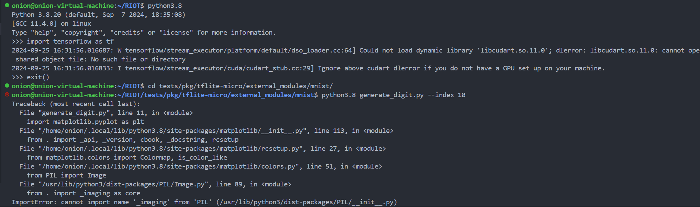

# 实验二: 基于TinyML进行设备运动状态识别
本实验将利用TinyML实现ESP32设备的姿态识别，基于上个实验，进行通过训练和部署轻量级的机器学习模型，判断设备的当前运动状态。

在实验一中，你们已经学会了如何使用多线程、如何控制LED RGB灯、读取MPU6050惯性传感器，并根据传感器数据使用了某种算法来判断设备运动状态。本实验需要使用AI模型替代算法识别设备运动状态。在本实验中，你们将简单学会模型训练到部署整个流程，具体包括以下内容:
1) 主机端与设备端结合: 数据集采集(设备运动状态所对应的MPU6050传感器数据)
2) 主机端: 模型创建、模型训练、模型测试、模型保存
3) 设备端: 部署模型、模型推理


### 实验目标：

- 了解TinyML的基本概念及其在嵌入式设备上的应用。
- 掌握模型训练、优化和部署的基本流程。
- 实现基于TinyML的姿态识别系统，判断ESP32设备的运动状态。

### 运行环境安装(Ubuntu22.04 和 Ubuntu 20.04 请按照对应的步骤进行安装。)
```bash
sudo apt install -y cmake
# python3.8 和 python3.9都可以，其余目前版本不兼容
# ubuntu 22.04 请执行下面命令
sudo apt install -y software-properties-common
sudo add-apt-repository ppa:deadsnakes/ppa -y

sudo apt update && sudo apt install -y python3-pip vim python3.8 python3.8-dev python3.8-distutils
echo 'export PATH=$PATH:$HOME/.local/bin' >> ~/.bashrc  
source ~/.bashrc

python3.8 -m pip install numpy~=1.19.2 matplotlib~=3.6.0 \
 tensorflow==2.6.0 scikit-learn protobuf==3.19.6 testresources \
 keras==2.6.0 pyserial jupyter~=1.0.0 typing-extensions~=3.7 -i https://pypi.tuna.tsinghua.edu.cn/simple


# ubuntu 20.04 请执行下面命令
sudo apt update && sudo apt install -y python3-pip vim python3.8 python3.8-dev python3.8-distutils
echo 'export PATH=$PATH:$HOME/.local/bin' >> ~/.bashrc  
source ~/.bashrc

python3.8 -m pip install numpy~=1.19.2 matplotlib~=3.6.0 \
 tensorflow==2.6.0 scikit-learn protobuf==3.19.6 testresources \
 keras==2.6.0 pyserial jupyter~=1.0.0 typing-extensions~=4.12 -i https://pypi.tuna.tsinghua.edu.cn/simple


# 测试
python3.8
>>> import tensorflow as tf
>>> exit()
```

上面导入tensorflow不出现报错即完成安装。

### 报错问题解决


如果ubuntu20.04系统, 环境安装后出现上面问题，可以直接忽略。


如果出现上面问题, 那么执行下面指令, 后续ipynb操作都在vscode上进行,具体vscode怎么运行ipynb文件,请参考[简单教程](https://blog.csdn.net/F_zHua/article/details/127627469)即可.
```bash
python3.8 -m pip install typing-extensions~=3.7 -i https://pypi.tuna.tsinghua.edu.cn/simple
```


### 测试tensorflow
```
wget https://gitee.com/emnets/emnets_experiment/releases/download/esp_tools/test_tensorflow.py
python3.8 test_tensorflow.py
```
输出结果如下所示，第一次会下载mnist数据集，这里图没有显示。


### 案例一: 手写字识别
#### (1) 运行案例
RIOT OS 官方给了`tests/pkg/tflite-micro/`案例, 其中使用MLP模型做手写字图像Mnist识别.
执行generate_digit.py 程序，使用数据集里面的第11张图片(即index=10, 从0开始的)， 创建digit文件，并获悉该图片的数字。
```bash
cd ~/RIOT/
cd tests/pkg/tflite-micro/external_modules/mnist/
python3.8 generate_digit.py --index 10 
```
<div style="text-align: center;">
  <figure>
    
  </figure>
</div>

可以看出数据集第11张图数字是0。


**遇到问题**:如果运行的时候，在`import matplotlib.pyplot as plt`出现问题，如下图所示。

请执行以下命令。
```bash
python3.8 -m pip install --upgrade Pillow
```


直接执行以下代码，即可运行手写字案例。第一次编译,需要很长的时间,适当等待下,可同时着手看第二个案例.(需要自动从github下载tflite-micro库,同时模型编译需要很长时间, 如果在这一步因一些元素,无法正常编译,请及时联系助教).

```bash
cd ~/RIOT/
esp_idf all
# sudo chmod 777 /dev/ttyUSB*
make BOARD=esp32-wroom-32 flash term -C tests/pkg/tflite-micro/
# 点击esp32 靠左侧的自启动按钮，按照提示输入's'，运行程序
```
> 2024-04-01 13:23:22,264 # Help: Press s to start test, r to print it is ready  
r  
2024-04-01 13:24:19,604 # READY  
s  
2024-04-01 13:24:20,342 # START  
2024-04-01 13:24:20,346 # main(): This is RIOT! (Version: 2024.04-devel-586-g48a8e6)  
2024-04-01 13:24:20,379 # Digit prediction: 0  

通过输出的log，不难发现，模型预测的数字也是0。

*注意： 如果你是容器的编译方法，那么执行以下代码(后续不再提示，只讲本地编译的方法):*
```bash
cd ~/RIOT/
# sudo chmod 777 /dev/ttyUSB*
BUILD_IN_DOCKER=1 DOCKER="sudo docker" \
    DOCKER_IMAGE=schorcht/riotbuild_esp32_espressif_gcc_8.4.0 \
    make BOARD=esp32-wroom-32 flash -C tests/pkg/tflite-micro/
make BOARD=esp32-wroom-32 term -C tests/pkg/tflite-micro/
```

下面是RIOT TinyML 案例下个各个文件以及含义。
> tests/pkg/tflite-micro/  
|-- Makefile                    
|-- Makefile.ci  
|-- README.md  
|-- external_modules                # 自定义模块  
|--|-- mnist                        # 手写字识别  
|--|--|-- Makefile                 # 定义了一个mnist模块，并加入模型和数据  
|--|--|-- digit                     # 模型识别输入的数据案例，默认是张数字7的图  
|--|--|-- generate_digit.py         # 生成digit的代码  
|--|--|-- main_functions.cc         # 类似Arduino风格的函数，包括模型导入和模型预测（关键）  
|--|--|-- mnist_mlp.py             # 模型训练和保存  
|--|--|-- model.tflite                # 已经训练好的模型  
|-- main.cpp                        # 主函数，很简单，可忽略  
|-- tests       
|--|-- 01-run.py  

从上述内容，不难看出，在烧给开发板的时候，模型已经是训练好的，数据可以是加载的，也可以是开发板通过传感器(iMU, 温度传感器，触感传感器等)获取的数据。这个案例,有兴趣的同学可在学完第二个案例后,自主研究.
### 案例二: 简单设备运动状态设别
该案例基本和正式实验对接,并且该案例将覆盖数据集准备,模型创建,模型训练,模型测试,生成可部署的模型文件,开发设备模型部署以及模型实时推理等全方面角度. 在仔细跟着该案例完成这个流程后,会发现正式实验基本上没难度.
#### 01 数据集获取
实验一中,传感器数据直接打印在串口(终端)里,我们需要将这些数据收集并保存同时分好类.本案例使用python的serial模块, 实时从串口收集数据,并保存成`.npy`数据文件.

1) 烧写程序
```bash
cd ~/RIOT/examples/emnets_experiment/11_tingml_get_datasets/
esp_idf all
make BOARD=esp32-wroom-32 flash
# 注意不要term
```
`11_tingml_get_datasets`文件夹下提供了采集数据集的代码。不难发现，与之前`02_threads_imu`代码基本一样，只改了打印log的格式。
```c++
LOG_INFO("[main]%d:(X,Y,Z):%.02f:%.02f:%.02f:(m/s^2)(XG,YG,ZG):%.02f:%.02f:%.02f:(°/s)\n", i, data.ax, data.ay, data.az, data.gx, data.gy, data.gz);
```
这里使用`LOG_INFO`替代`printf`,当需要从串口采集信息时，尽量用`LOG_INFO`函数，用法与`printf`一致。至于为什么用`:`隔开数据，是为了后续方便数据处理(`python split()函数`)。

2) 采集数据

接下来查看python采集数据代码`11_tingml_get_datasets/store_data.py`。
```python
# 最大记录数
MAX_NUM = 200
def main():
    # 创建 ArgumentParser 对象
    parser = argparse.ArgumentParser(description="指定运动状态")

    # 添加 GPU 索引参数，使用 type=int 确保输入是整数
    parser.add_argument(
        "-d", "--direction", type=int, default=0, help="指定运动状态，默认为0,静止"
    )
    # 解析命令行参数
    args = parser.parse_args()
    _directions = ["Stationary", "Tilted", "Rotating", "Moving"]  # 定义方向选项
    control = SerialControl(
        direction=_directions[args.direction]
    )  # 创建SerialControl对象，设置方向为"Moving"
    control.get_log()  # 调用get_log方法读取数据
```
上面只需要注意`MAX_NUM`,`_directions`以及`args.direction`即可。`MAX_NUM`定义当前需要采集次数, 可自行调整，尽量大于100，`_directions`列表记录四种运动状态**平躺静止、倾斜静止、移动、旋转**(可自行调整，如添加运动状态，将移动划分为向左、向右或X轴移动、Y轴移动等等)，`args.direction`帮助我们从程序外加载数据。
如采集第一个种情况，`Stationary`执行`python3 store_data.py --direction 0`, 自动将`args.direction`设置为0。
```bash
cd ~/RIOT/examples/11_tingml_get_datasets/
# Stationary
python3.8 store_data.py --direction 0
# Tilted
python3.8 store_data.py --direction 1
# Rotating
python3.8 store_data.py --direction 2
# Moving
python3.8 store_data.py --direction 3
```
每种情况，多采几次，建议20次以上，尽量采不同重复真实状态，如`Tilted` **X轴倾斜(分大角度、小角度)、Y轴倾斜、Z轴倾斜**，**移动可以X轴移动、Y轴移动，往复移动、平面上随意移动、平面上画圈等等**，**旋转可空中任意方向旋转**等，除了`--direction`和状态一直外，程序重复执行即可，不会出现数据覆盖问题。

**采集方式: `store_data.py`程序执行前，就确保设备已经按要求处于某种运动状态。** 如: 设备已经移动了，保持一直移动，然后执行数据采集程序，程序结束后，即可停止。

Note：数据集越丰富，后续模型性能大概率越好。采集后，数据保存在`10_tingml_datasets`文件夹下，格式是`运动状态_时间戳.npy`，类似下图所示。采集到的样本,可直接通过`numpy`的`load`函数加载，类似这样`data = np.load(运动状态_时间戳.npy)`, data的尺寸是(MAX_NUM, 6)，是个二维的列表，6代表6轴数据即(ax,ay,az,gx,gy,gz),整个数据代表连续MAX_NUM次的6轴数据。


#### 02 模型创建、训练、测试、生成部署模型
该环节请查看`12_tingml_gesture_predict_experiment/external_modules/gesture/train.ipynb`文件，该文件给出整个详细模型训练的参考案例.
如何在`.ipynb`文件上运行，如果在终端，请在请自行上网搜索`jupyter notebook`等相关内容，遇到麻烦，请及时联系助教。 
```bash
# 如果在虚拟机里面
cd ~/RIOT/examples/emnets_experiment/12_tingml_gesture_predict_experiment/external_modules/gesture/
python3.8 -m jupyter notebook
# 在弹出来的网页，进入train.ipynb, 然后按网上教程进行即可。
```
基本上，在一个代码方块里面，按SHIFT+Enter即可。需要重新运行所有代码，就点击上面restart。

建议在VSCODE运行`.ipynb`文件，VSCODE Extensions插件 需要安装`python`和`jupyter`,然后直接带开`.ipynb`文件，右上角的kernel选中python3.8,后续操作后上述一致。

具体如何操作`.ipynb`文件请参考[jupyter notebook教程](https://zhuanlan.zhihu.com/p/675002837)。

#### 03 部署模型
1) 数据获取。为节省展示空间，下面代码与实际代码存在差异，只为解释关键部分。`12_tingml_gesture_predict_experiment/main.cpp``get_imu_data`收集一个样本的MPU6050传感器数据，并调用模型做预测。需要注意`SAMPLES_PER_GESTURE`和`class_num`需要与训练时的参数对应。`class_num`对应label种类数，`SAMPLES_PER_GESTURE`代表每个样本需要连续多少份数据。调用`predict`函数得到最终结构，该函数第一个参数是样本第一个数据的地址，第二个参数是样本长度, 第三个参数表示只有概率大于`threshold`，预测结果可信, 第四个参数表示分类数量`class_num`。
```c++
#define SAMPLES_PER_GESTURE (10)
#define class_num (4)
void get_imu_data(MPU6050 mpu, float *imu_data){
    int16_t ax, ay, az, gx, gy, gz;
    for(int i = 0; i < SAMPLES_PER_GESTURE; ++i)
    {
        /* code */
        delay_ms(20);
        mpu.getMotion6(&ax, &ay, &az, &gx, &gy, &gz);
        imu_data[i*6 + 0] = ax / accel_fs_convert;
        imu_data[i*6 + 1] = ay / accel_fs_convert;
        imu_data[i*6 + 2] = az / accel_fs_convert;
        imu_data[i*6 + 3] = gx / gyro_fs_convert;
        imu_data[i*6 + 4] = gy / gyro_fs_convert;
        imu_data[i*6 + 5] = gz / gyro_fs_convert;
    }
} 
void *_motion_thread(void *arg)
{
    float imu_data[SAMPLES_PER_GESTURE * 6] = {0};
    int data_len = SAMPLES_PER_GESTURE * 6;
    // ...
    // ...
    int ret;
    float threshold = 0.8;
    while(1)
    {
        delay_ms(predict_interval_ms);    
        get_imu_data(mpu, imu_data);
        ret = predict(imu_data, data_len, threshold, class_num);
    }
}
```
2) 模型部署以推理。接下来，将详细介绍，`tflite-micro`库的使用。这里代码在`12_tingml_gesture_predict_experiment/external_modules/gesture/main_functions.cc`。头文件引入保持案例不变即可。`#include "blob/model.tflite.h"`导入前面训练好的模型,`model.tflite`，这里注意，在该文件同路径的Makefile文件，里面通过`BLOBS += model.tflite`添加模型，在编译的时候，模型参数也参与编译，在bin文件夹里面生成了`model.tflite.h`头文件，有兴趣的同学可去`bin/esp32-wroom-32/gesture/blobs/blob/model.tflite.h`文件查看内容，思考模型以什么形式存在。
`kTensorArenaSize`会给模型导入推理预留一定的空间，不可小于模型的需求。
`model = tflite::GetModel(model_tflite);`为模型加载方式。

```c++

#include "blob/model.tflite.h"
// 12_tingml_gesture_predict_experiment/external_modules/gesture/main_functions.cc
// 类似Arduino方式，创建全局可访问变量
// Globals, used for compatibility with Arduino-style sketches.
namespace {
    const tflite::Model* model = nullptr;
    tflite::MicroInterpreter* interpreter = nullptr;
    TfLiteTensor* input = nullptr;
    TfLiteTensor* output = nullptr;
    // Create an area of memory to use for input, output, and intermediate arrays.
    // Finding the minimum value for your model may require some trial and error.
    constexpr int kTensorArenaSize = 32 * 1024;
    uint8_t tensor_arena[kTensorArenaSize];
}  // namespace


// The name of this function is important for Arduino compatibility.
void setup()
{
#if IS_USED(MODULE_TFLITE_MICRO)
    tflite::InitializeTarget();
#endif
    // Map the model into a usable data structure. This doesn't involve any
    // copying or parsing, it's a very lightweight operation.
    // 模型导入
    model = tflite::GetModel(model_tflite);
    // This pulls in all the operation implementations we need.
    static tflite::MicroMutableOpResolver<9> resolver;
    if (resolver.AddConv2D() != kTfLiteOk) {
        return;
    }
    if (resolver.AddExpandDims() != kTfLiteOk)
    {
        return;
    }
    if (resolver.AddReshape() != kTfLiteOk)
    {
        return;
    }
    if (resolver.AddRelu() != kTfLiteOk) {
        return;
    }
    if (resolver.AddMean() != kTfLiteOk) {
        return;
    }
    
    if (resolver.AddFullyConnected() != kTfLiteOk) {
        return;
    }
    if (resolver.AddQuantize() != kTfLiteOk) {
        return;
    }
    if (resolver.AddDequantize() != kTfLiteOk) {
        return;
    }
    if (resolver.AddSoftmax() != kTfLiteOk) {
        return;
    }
    // Build an interpreter to run the model with.
    static tflite::MicroInterpreter static_interpreter(
        model, resolver, tensor_arena, kTensorArenaSize);
    interpreter = &static_interpreter;

    // Allocate memory from the tensor_arena for the model's tensors.
    TfLiteStatus allocate_status = interpreter->AllocateTensors();
    if (allocate_status != kTfLiteOk) {
        puts("AllocateTensors() failed");
        return;
    }
}


```
`static tflite::MicroMutableOpResolver<9> resolver;`需要注意添加的东西，如何没有添加模型所需要的模块，会报错，如未添加卷积层(这里conv2d和conv1d都用`resolver.AddConv2D()`加载),设备将报错，提示没有'CONV_2D', 碰到这种情况只需要找到对应的添加函数，执行即可，注意resolver分配的数量，如数量不够，需要增大数量，这里声明的时候，设定数量是9.其余无需修改，查看注释即可。
> 2024-08-07 01:36:02,365 # Didn't find op for builtin opcode 'CONV_2D'  
> 2024-08-07 01:36:02,368 # Failed to get registration from op code CONV_2D  

3) 模型创建导入已经结束，接下来是模型推理。首先, 每次推理需要拿到输入空间`input = interpreter->input(0);`和输出空间`output = interpreter->output(0);`开始的张量地址，并将输入复制到模型的输入空间；然后，执行模型推理`interpreter->Invoke();`；最后，拿到得到推理结果，这里分类模型拿到的是每个标签的概率，找到预测概率最高对应的标签，并查看其概率是否超过阈值。
```c++
// 12_tingml_gesture_predict_experiment/external_modules/gesture/main_functions.cc
int predict(float *imu_data, int data_len, float threshold, int class_num){
    input = interpreter->input(0);
    output = interpreter->output(0);
    // 输入导入，input->data.f[i]
    for (unsigned i = 0; i < data_len; ++i) {
        input->data.f[i] = static_cast<float>(imu_data[i]);
    }
    // 执行推理
    TfLiteStatus invoke_status = interpreter->Invoke();
    // 找到预测概率最高对应的标签，并查看其概率是否超过阈值
    float val = 0;
    uint8_t res = 0;
    for (unsigned i = 0; i < class_num; ++i) {
        float current = output->data.f[i];
        if (current > threshold && current > val) {
            val = current;
            res = i;
        }
    }
    return res;
}

```
#### 04 案例运行
假设你根据前面训练，已经得到训练好的模型了。按下面内容执行操作.
```bash
cd ~/RIOT/
cd examples/emnets_experiment/12_tingml_gesture_predict_experiment
esp_idf all
make BOARD=esp32-wroom-32 flash term
```

得到类似以下结果图, 结果分析,根据当前数据,模型认为88%的可能性是设备处于平躺静止状态,11%的可能性设备处于旋转状态,最终判定为平躺静止状态.
> 2024-08-07 01:48:53,332 # ------------------------------  
> 2024-08-07 01:48:53,335 # [0] value: 0.88  
> 2024-08-07 01:48:53,335 # [1] value: 0.00  
> 2024-08-07 01:48:53,337 # [2] value: 0.11  
> 2024-08-07 01:48:53,338 # [3] value: 0.00  
> 2024-08-07 01:48:53,340 # Motion prediction: 0  
> 2024-08-07 01:48:53,341 # Predict: 0, Stationary  


### 正式实验: 基于神经网络进行设备运动状态识别

该环节代码仍然处于`12_tingml_gesture_predict_experiment`，通过上面几个案例，想必你们已经会数据集收集、模型创建、数据集导入、模型训练、模型测试、模型生成部署以及最终的推理，本实验需要将这几部分结合，实现以下具体功能：
1) 完善`12_tingml_gesture_predict_experiment/ledcontroller.cpp`两个函数，这个直接拷贝你们实验一时候写好的代码。
2) 完善`12_tingml_gesture_predict_experiment/main.cpp`多处代码, 实现多线程, 一:定期神经网络识别设备运动状态并打印结果, 二:led根据识别结果显示不同颜色, 可同实验一.
3) 案例给出了MLP模型和CNN模型,请从模型训练,模型测试以及真实部署三个方面进行识别准确度性能对比.
4) 自主设计一个运动状态识别模型(其他模型结构或者适当增大模型参数),要去比案例的CNN模型性能好.
5) 加分点: 实现分辨更多运动状态，如X轴方向平移、Y轴方向平移等等; 给出不同模型更多角度的性能评价如推理时间开销(主机端测试时或者实际ESP32部署时推理开销); 模型创新度高; 计算出模型在ESP32部署时所需要的最小内存开销; 提交真实的视频成果(能有效展示设备运动状态识别情况).

完成上述内容后，请撰写实验报告，录制结果视频，在截至时间前，在**学在浙大**上，上传报告和视频成果。

**注意**：按着教程案例走,基本上在模型推理方面得到一个简单的版本方案,且结合根据第一个实验的内容,简单版本是完成了, 适当增大模型参数(如通道数),在某些模型结构可获得不错的性能.

在`12_tingml_gesture_predict_experiment`,`21_nimble_gatt_experiment`, `31_mqtt_thingsboard_experiment`里面代码有一行存在问题，请在这些文件夹的`main.cpp`的`get_imu_data()`函数里，按下面图中所示，将`i+=1;`去掉。


### 问题解答

(1) 问题一
> external_modules/gesture/main_functions.cc: In function 'void setup()':  
main_functions.cc:95:56: error: no matching function for call to 'tflite::MicroInterpreter::MicroInterpreter(const tflite::Model*&, tflite::MicroMutableOpResolver<9>&, uint8_t [32768], const int&)'  
   95 |         model, resolver, tensor_arena, kTensorArenaSize);  

如果遇到以上问题,请保存实验代码后，重新下载RIOT-OS系统。

```bash
cd ~
mv ~/examples/emnets_experiment .
rm -rf RIOT
git clone https://github.com/RIOT-OS/RIOT -b 2024.10-devel
mv emnets_experiment ~/RIOT/examples/
```

(2) ‵make BOARD=esp32-wroom-32 term -C tests/pkg/tflite-micro/`指令出现以下问题，
> env: 'cmake': No such file or directory  

请执行以下命令:
```bash
sudo apt install -y cmake
```

(3) 如遇到类似下面问题，提示缺少什么op:
> 2024-08-07 01:36:02,365 # Didn't find op for builtin opcode 'CONV_2D'  
> 2024-08-07 01:36:02,368 # Failed to get registration from op code CONV_2D  

请到 `~/RIOT/build/pkg/tflite-micro/tensorflow/lite/micro/micro_mutable_op_resolver.h` 文件中找到对应的添加方法.

* AddAbs()
* AddAdd()
* AddAveragePool2D()
* AddConv2D()
* AddDelay()
* AddDepthwiseConv2D()
* AddDequantize()
* AddQuantize()
* AddMean()
* AddLogSoftmax()
* AddSoftmax()
* AddReshape()
* AddRelu()
* ...

然后在`external_modules/gesture/main_functions.cc`里面,改大resolver数量,然后加入上述方法.例如,这里要添加`Add`
```c++
// main_functions.cc
// 下面数量是10,原来是9,这里我们添加一个op, Add
static tflite::MicroMutableOpResolver<10> resolver;
if (resolver.AddAdd() != kTfLiteOk) {
    return;
}
```

(4) 如果碰到内存相关的问题，请改小模型或者修改kTensorArenaSize.

### ACKNOWLEDGMENTS
特别感谢孙同学在解决Python环境中TensorFlow版本安装问题上提供的帮助。同时，鼓励其他同学在遇到并解决类似问题后，积极联系助教，分享自己的解决方案，共同促进学习社区的进步。