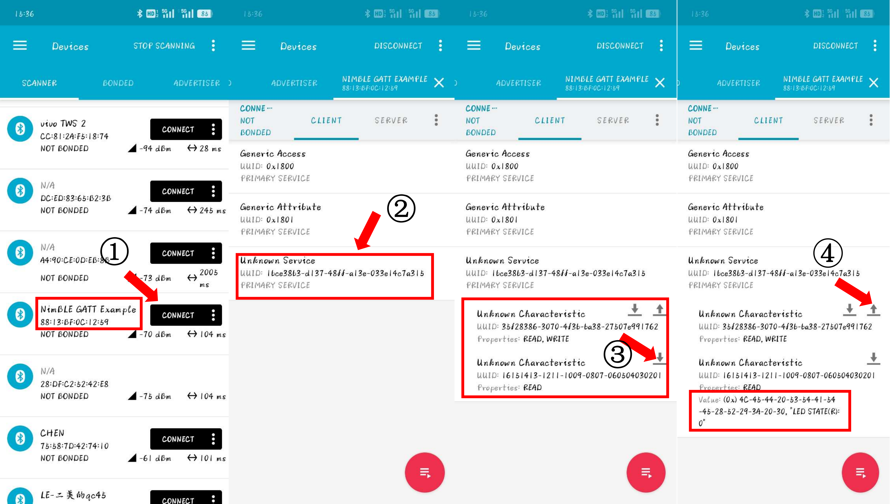
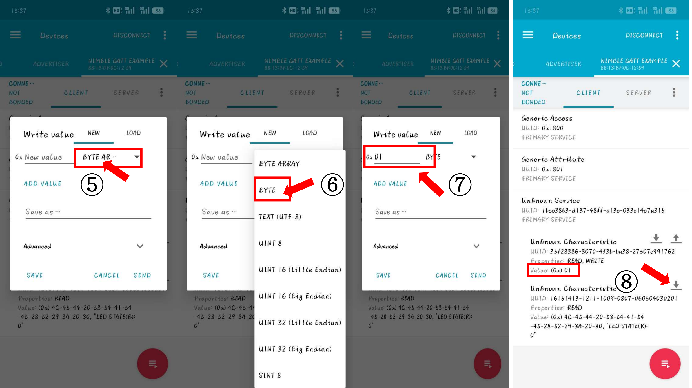

## 实验三: BLE nimble GATT 通信
本部分实验将深入探讨使用BLE nimble库实现通用属性配置文件（GATT）通信。GATT是BLE协议栈中用于设备服务和特性管理的架构，它支持设备间的数据交互。通过本实验，学生将学习如何定义、配置和使用GATT服务和特性，以实现复杂的数据交互和设备控制功能，最终展示成果需要结合整合前面两个实验，手机端可获取设备的数据(如传感器数据，设备运动状态)，也能发送数据到设备端，设备在线作出一定反馈操作(如用户发送设备模型识别的阈值或识别的频率，设备需要更新模型识别阈值以及频率)。

### 实验目标：
- 理解BLE GATT协议的结构和功能。
- 掌握如何使用BLE nimble库定义和管理GATT服务和特性。
- 学习如何通过GATT特性进行数据的读取和写入。
- 实现一个能够通过GATT服务交换数据的BLE设备。
### 案例: 通过GATT服务器获取并控制LED DEMO
`20_nimble_gatt`案例在设备上创建一个NIMBLE GATT服务器，该服务器创建一个可读写以及一个只读的特性，用户可以在任何设备如(PC,手机端,支持蓝牙的开发板等)，通过蓝牙连接该服务器，访问这两个特性，通过特性读取数据或写入数据，来控制ESP32开关LED RGB模块。通过该案例，希望同学们学会如何创建可读写自定义特性的GATT服务器。

#### (1) 运行案例
```bash
esp_idf all
# sudo chmod 777 /dev/ttyUSB*
cd ~/RIOT/examples/emnets_experiment/20_nimble_gatt/
# 正常执行以下编译命令即可
make BOARD=esp32-wroom-32 flash term
# 注意每次烧写完，点击ESP32左侧reset按钮
```
完成上述操作后，终端串口会打印以下信息:
> 2024-08-08 17:29:22,292 # main(): This is RIOT! (Version: 2024.10-devel-39-g340caa)  
> 2024-08-08 17:29:22,294 # NimBLE GATT Server Example  
> 2024-08-08 17:29:22,300 # LED Controller initialized with (RGB: GPIO26, GPIO25, GPIO27)  
> 2024-08-08 17:29:22,302 # [LED_THREAD] WAIT  
> 2024-08-08 17:29:22,303 # [MAIN] LED_PID: 6  
> 2024-08-08 17:29:22,306 # Default MAC address: 88:13:BF:0C:12:59  

同时打印默认蓝牙MAC地址，每个设备默认MAC地址不一样，案例这个ESP32设备显示MAC地址为`88:13:BF:0C:12:59`
接下来需要用到手机或者电脑与之通信，不同手机系统的同学请看对应部分进行后续操作。

**苹果手机可直接去应用市场下载 nRFConnect 软件，具体使用方法与下面安卓操作类似。**
##### 基于安卓系统的手机 
手机的操作系统属于Android, 请安装`20_nimble_gatt/nRFConnect_4_28_1.apk` APP。
1) 打开nRFConnect APP，找到蓝牙名为**NimBLE GATT Example**的蓝牙, 同时留意蓝牙名下面的MAC地址，图中是**88:13:BF:0C:12:59**, **操作一:点击`CONNECT`，与ESP32服务器蓝牙建立连接**。
2) 找到第三个服务，其UUID为`1bce38b3-d137-48ff-a13e-033e14c7a315`,**操作二：点击该服务**。
3) 该服务，会显示两个特性，第一个特性，UUID为`35f28386-3070-4f3b-ba38-27507e991762`，其特性为可读可写(`READ, WRITE`)；第二个特性，UUID为`16151413-1211-1009-0807-060504030201`，其特性为只可读(`READ`)。箭头朝上表示写，朝下表示读。**操作三：点击第二特型上的箭头(朝下)，将请求读取LED灯状态**。
4) 操作三后，红框处，服务三的第二个特性`value`更新，内容包含**LED STATE(R):0**, 读完成。**操作四： 点击第一个特性的朝上箭头进行写操作，请求设置LED灯状态。**
 
5) **操作五：在弹出的写操作页面，点击 `BYTE AR...`**
6) **操作六：选择单位为`BYTE`**，这些单位按字面意思就能理解。
7) **操作七：在单位前的横线输入01**, 并点击`SEND`按钮，发送信息。
8) 上一操作完成后，可以发现第一个特性的`Value`更新为(0x)01, 此时留意ESP32连接的LED RGB模块，红灯亮起。 **操作八：点击第二个特性的读箭头**，第二个特性的`Value`内容更新，包含**LED STATE(R):1**。


 


后续，请参考上述操作，发送0x00数据(注意两个0)，关闭LED灯。请留意上述提到的所有`UUID`。

##### 基于Linux电脑或虚拟机的python脚本
1) 安装python `bluepy`库。
```bash
sudo apt-get install python3-pip libglib2.0-dev
sudo python3.8 -m pip install bluepy==1.1.4
sudo hciconfig hci0 down && sudo hciconfig hci0 up
```
2) 根据刚才串口打印的`Default MAC address: 88:13:BF:0C:12:59`, 将MAC地址替换send_ble.py第15行的`target_address`,注意mac addr 这里需要用小写字母如**88:13:BF:0C:12:59**需要改成**88:13:bf:0c:12:59**，不然找不到对应设备。执行`send_ble.py`脚本。如果出现无法连接的情况，且终端显示`mismatch`等信息，需要重启以下ESP32或者多执行几次脚本，多尝试几次。目前，脚本还不稳定。

```bash
cd ~/RIOT/examples/emnets_experiment/20_nimble_gatt/
sudo python3.8 send_ble.py
# sudo python3 -m pip install bluepy==1.1.4
# 运行scan()时可能需要sudo权限
# sudo python3 send_ble.py
```
`send_ble`自行查看`scan()`和`send()`函数，`scan()`扫描周边所有蓝牙，`send()`里面会先通知设备开灯，然后5秒后，设备关灯，期间会多次读led
状态。如果，基于该方案的学生，需要将`scan()`和`send()`结果打印信息保存(复制或截图)。

`scan()`执行结果,类似下面输出: 

> Device 5d:68:9b:a1:c7:64 (type=random) (RSSI=-80):  
>   Flags: 1a   
>   Manufacturer: 4c000512000000000000000001dccac994ce81844e00   
> Device 5f:36:9a:77:e7:78 (type=random) (RSSI=-74):  
>   Flags: 1a   
>   Manufacturer: 4c00090813120aa24b061b5816080065bc5a27cfb5d6   
> Device 7e:57:58:2e:48:d0 (type=public) (RSSI=-63):  
>   Flags: 06   
>   16b Service Data: f7fd01416710b51fa44fdeba0962e835e9d72d0000000003   
>   Complete 16b Services: 0000fe78-0000-1000-8000-00805f9b34fb   
>   Manufacturer: 650001c906   
> Device 88:13:bf:0c:12:59 (type=public) (RSSI=-39):  
>   Flags: 06   
>   Complete Local Name: NimBLE GATT Example   

`send()`执行结果,类似下面输出:

> Target device 88:13:bf:0c:12:59 found, attempting to connect...  
> Get Data: LED STATE(R): 0  
> Data 'b'\x01'' written to characteristic.  
> Get Data: LED STATE(R): 1  
> Data 'b'\x00'' written to characteristic.  
> Get Data: LED STATE(R): 0  
> Disconnected from device.  

`send()`错误结果，如下,多执行几次,多次不行，esp32 reset一下(**或者检查是否有其他设备连接ESP32的GATT服务器**):
> Failed to connect or communicate with the device: Failed to connect to peripheral 88:13:bf:0c:12:59, addr type: public  

##### 基于Windows系统
如果使用基于wsl2的虚拟机，虚拟机可能不支持蓝牙，且windows系统不支持bluepy库, 那么可以使用python bleak库, 在windows系统安装好python3后，具体教程请查看[bleak官方](https://github.com/hbldh/bleak)以及[参考教程](https://blog.csdn.net/rory_wind/article/details/128821945#:~:text=windows%20%E7%AB%AF%E4%BD%BF)
```bash
pip install bleak
```

#### (2) 案例代码解释
##### 2.1 Makefile
```bash
# 20_nimble_gatt/Makefile
USEPKG += nimble
USEMODULE += nimble_svc_gap
USEMODULE += nimble_svc_gatt
# Use automated advertising
USEMODULE += nimble_autoadv
CFLAGS += -DCONFIG_NIMBLE_AUTOADV_DEVICE_NAME='"NimBLE GATT Example"'
CFLAGS += -DCONFIG_NIMBLE_AUTOADV_START_MANUALLY=1
```
`20_nimble_gatt/Makefile`
1) nimble: 这是一个包含 NimBLE 核心库的模块。NimBLE 是一个开源的 BLE（Bluetooth Low Energy）协议栈，实现了 BLE 的基本功能，包括连接管理、数据传输、安全性等。
2) nimble_svc_gap: 这个模块实现了 Generic Access Profile (GAP) 服务。GAP 是 BLE 协议栈的一部分，负责设备的发现、连接建立和连接维护等功能。使用这个模块可以管理 BLE 设备的可发现性和连接特性。如`NimBLE GATT Example`蓝牙名是通过该模块设置的。
3) nimble_svc_gatt: 这个模块实现了 Generic Attribute Profile (GATT) 服务。GATT 定义了 BLE 设备之间如何交换数据。通过这个模块，可以定义服务和特征，用于在 BLE 设备之间传输数据。该案例用到最多的就是该模块。
4) nimble_autoadv: 这个模块用于自动广播。BLE 设备通过广播信息来让其他设备发现自己。使用这个模块可以自动处理广播包的发送，简化开发过程。
##### 2.2 main: #include, 头文件介绍
```c++
// 20_nimble_gatt/main.cpp
#include "nimble_riot.h"
#include "nimble_autoadv.h"
#include "host/ble_hs.h"
#include "host/util/util.h"
#include "host/ble_gatt.h"
#include "services/gap/ble_svc_gap.h"
#include "services/gatt/ble_svc_gatt.h"
```
1) **nimble_riot.h**: 将 NimBLE 协议栈与 RIOT 操作系统集成起来。它提供了在 RIOT 中使用 NimBLE 所需的初始化和配置功能。
2) **nimble_autoadv**: 包含了与自动广播相关的功能。
3) **host/ble_hs.h**: 包含了 NimBLE 主机（host）堆栈的核心功能。它定义了 BLE 主机的主要接口和数据结构，管理 BLE 连接、GATT 服务、GAP 和其他 BLE 操作。
4) **host/util/util.h**: 包含了主机堆栈中使用的实用函数和宏。它提供了各种辅助功能，如数据转换、内存操作等，支持 BLE 协议栈的实现。
5) **host/ble_gatt.h**: 包含了与 Generic Attribute Profile (GATT) 相关的功能。GATT 定义了如何在 BLE 设备之间交换数据，提供了服务和特征的接口和数据结构。
6) **services/gap/ble_svc_gap.h**: 包含了 Generic Access Profile (GAP) 服务的定义和实现。GAP 负责设备的发现、连接建立和连接维护等功能。
7) **services/gatt/ble_svc_gatt.h**: 包含了 Generic Attribute Profile (GATT) 服务的定义和实现。它提供了创建和管理 GATT 服务和特征的接口，使 BLE 设备能够定义自己的数据结构和通信方式。

这些头文件共同提供了在 RIOT 操作系统中使用 NimBLE 蓝牙协议栈的完整功能，从基础的协议栈初始化、广播处理到高层的服务定义和数据交换。有兴趣的同学可前去`~/RIOT/pkg/nimble/`以及`~/RIOT/build/pkg/nimble/nimble/`路径查看NimBLE 蓝牙协议栈的完整内容，里面蓝牙存在不少线程。

##### 2.3 main: gatt 定义服务
结构体放着，参考一下即可，不必深究。
```c++
// build/pkg/nimble/nimble/host/include/host/ble_uuid.h
/** 128-bit UUID */
typedef struct {
    ble_uuid_t u;
    uint8_t value[16];
} ble_uuid128_t;

```
`ble_uuid128_t` 前面案例UUID，`u`代表UUID的类型，如32位，128位等，`value`就是案例显示的UUID内容。
```c++
// 20_nimble_gatt/main.cpp
/* UUID = 1bce38b3-d137-48ff-a13e-033e14c7a335 */
// 服务UUID，对应着上面图中的第三个服务UUID，注意UUID和最终外面访问到的是反过来的。
static const ble_uuid128_t gatt_svr_svc_rw_demo_uuid
        = {{128}, {0x15, 0xa3, 0xc7, 0x14, 0x3e, 0x03, 0x3e, 0xa1, 0xff,
                0x48, 0x37, 0xd1, 0xb3, 0x38, 0xce, 0x1b}};
// 服务UUID，对应着上面图中的第三个服务第一个特性的UUID，注意UUID和最终外面访问到的是反过来的。
/* UUID = 35f28386-3070-4f3b-ba38-27507e991762 */
static const ble_uuid128_t gatt_svr_chr_rw_demo_write_uuid
        = {{128}, {0x62, 0x17, 0x99, 0x7e, 0x50, 0x27, 0x38, 0xba, 0x3b,
                0x4f, 0x70, 0x30, 0x86, 0x83, 0xf2, 0x35}};
// 服务UUID，对应着上面图中的第三个服务第二个特性的UUID，注意UUID和最终外面访问到的是反过来的。
/* UUID = 16151413-1211-1009-0807-060504030201 */
static const ble_uuid128_t gatt_svr_chr_rw_demo_readonly_uuid
        = {{128}, {0x01, 0x02, 0x03, 0x04, 0x05, 0x06, 0x07, 0x08, 0x09,
                0x10, 0x11, 0x12, 0x13, 0x14, 0x15, 0x16}};

// 特性访问的对应自定义函数
static int gatt_svr_chr_access_rw_demo(
        uint16_t conn_handle, uint16_t attr_handle,
        struct ble_gatt_access_ctxt *ctxt, void *arg);
// -------------------------------------------------
// 定义蓝牙服务
static const struct ble_gatt_svc_def gatt_svr_svcs[] = {
    /*
     * access_cb defines a callback for read and write access events on
     * given characteristics
     */
    {
        /* Service: Read/Write Demo */
        .type = BLE_GATT_SVC_TYPE_PRIMARY,
        .uuid = (ble_uuid_t*) &gatt_svr_svc_rw_demo_uuid.u,
        .characteristics = (struct ble_gatt_chr_def[]) { {
            /* Characteristic: Read/Write Demo write */
            .uuid = (ble_uuid_t*) &gatt_svr_chr_rw_demo_write_uuid.u,
            // 触发的函数，即用户点击后，服务会直接执行的函数。
            .access_cb = gatt_svr_chr_access_rw_demo,
            // 指定访问权限，可读可写
            .flags = BLE_GATT_CHR_F_READ | BLE_GATT_CHR_F_WRITE,
        }, {
            /* Characteristic: Read/Write Demo read only */
            .uuid = (ble_uuid_t*) &gatt_svr_chr_rw_demo_readonly_uuid.u,
            .access_cb = gatt_svr_chr_access_rw_demo,
            .flags = BLE_GATT_CHR_F_READ,
        }, {
            0, /* No more characteristics in this service */
        }, }
    },
    {
        0, /* No more services */
    },
};
```

服务的创建需要表明`type`, `uuid`, `characteristics`, 特性需要`uuid`, `access_cb`触发的自定义函数，`flags`访问权限。
服务创建，参考上述模板即可，重点注意`uuid`, `access_cb`和`flags`，uuid随意自定义，不超过128bit。
##### 2.4 main: GATT Server添加服务, 并广播工作。
```c++
// 20_nimble_gatt/main.cpp
// 检查服务配置信息
ble_gatts_count_cfg(gatt_svr_svcs);
// 添加服务
ble_gatts_add_svcs(gatt_svr_svcs);
// 设置设备蓝牙名
// CONFIG_NIMBLE_AUTOADV_DEVICE_NAME对应前面Makefile中的
// CFLAGS += -DCONFIG_NIMBLE_AUTOADV_DEVICE_NAME='"NimBLE GATT Example"'
ble_svc_gap_device_name_set(CONFIG_NIMBLE_AUTOADV_DEVICE_NAME);
// GATT 服务器工作
ble_gatts_start();
// -------------------------------
// 开始广播
// void nimble_autoadv_start(ble_addr_t *addr);
nimble_autoadv_start(NULL);
// 停止广播
nimble_autoadv_stop();
```
查看上述注释即可明白，基本不会有变化，需要留意一下，`nimble_autoadv_start`输入为`NULL`时，将采用默认蓝牙MAC地址，每个设备出厂时都有个独特的MAC物理地址，这里可以自定义MAC地址，查看格式，可自行修改蓝牙地址。(**自行思考下，MAC地址可变的好处是什么？**)
```c++
// build/pkg/nimble/nimble/include/nimble/ble.h
typedef struct {
    uint8_t type;
    uint8_t val[6];
} ble_addr_t;
```
##### 2.5 main: 特性访问函数
```c++
#define DEMO_BUFFER_SIZE 100
#define STR_ANSWER_BUFFER_SIZE 100
static char rm_demo_write_data[DEMO_BUFFER_SIZE] = "This characteristic is read- and writeable!";
static char str_answer[STR_ANSWER_BUFFER_SIZE];
static int gatt_svr_chr_access_rw_demo(
        uint16_t conn_handle, uint16_t attr_handle,
        struct ble_gatt_access_ctxt *ctxt, void *arg)
{
    (void) conn_handle;
    (void) attr_handle;
    (void) arg;
    int rc = 0;
    // 第一个特性，可读可写
    ble_uuid_t* write_uuid = (ble_uuid_t*) &gatt_svr_chr_rw_demo_write_uuid.u;
    // 第二个特性，只读
    ble_uuid_t* readonly_uuid = (ble_uuid_t*) &gatt_svr_chr_rw_demo_readonly_uuid.u;
    if (ble_uuid_cmp(ctxt->chr->uuid, write_uuid) == 0) {
        // 判断操作类型，读写
        switch (ctxt->op) {
            case BLE_GATT_ACCESS_OP_READ_CHR:
                /* send given data to the client */
                rc = os_mbuf_append(ctxt->om, &rm_demo_write_data,
                                    strlen(rm_demo_write_data));
                break;
            case BLE_GATT_ACCESS_OP_WRITE_CHR:
                uint16_t om_len;
                om_len = OS_MBUF_PKTLEN(ctxt->om);
                /* read sent data */
                rc = ble_hs_mbuf_to_flat(ctxt->om, &rm_demo_write_data,
                                         sizeof(rm_demo_write_data), &om_len);
                /* we need to null-terminate the received string */
                rm_demo_write_data[om_len] = '\0';
                // 根据rm_demo_write_data内容通知LED灯线程开关灯...
                // ...
                break;
            default:
                rc = 1;
                break;
        }
        return rc;
    }
    else if (ble_uuid_cmp(ctxt->chr->uuid, readonly_uuid) == 0) {
        if (ctxt->op == BLE_GATT_ACCESS_OP_READ_CHR) {
            snprintf(str_answer, STR_ANSWER_BUFFER_SIZE, "LED STATE(R): %d", r_led_state);
            rc = os_mbuf_append(ctxt->om, &str_answer, strlen(str_answer));
            return rc;
        }
        return 0;
    }
    return 1;
}
```
特性绑定的函数`gatt_svr_chr_access_rw_demo`对特性的读写内容进行处理，可保存用户写的数据，也可发送用户请求读的数据。
上述函数参数只需要留意`struct ble_gatt_access_ctxt *ctxt`即可，其结构体可查看本页页面部分，记录gatt操作类型(op, 读写)、gatt访问数据(om, 从里面读，写里面去)，以及对应的特性定义如UUID。其余参数用不到。

1) `ble_uuid_cmp(ctxt->chr->uuid, write_uuid) == 0`判断是否是第一个特性（可读可写），`(ble_uuid_cmp(ctxt->chr->uuid, readonly_uuid) == 0)`判断是否是第二个特性(只读)。
2) 通过`ctxt->op`判断操作类型。
3) `int os_mbuf_append(struct os_mbuf *om, const void *data,  uint16_t len);`把数据写入，发给用户。
4) `uint16_t om_len = OS_MBUF_PKTLEN(ctxt->om);` 获取用户发来数据长度
5) `int ble_hs_mbuf_to_flat(const struct os_mbuf *om, void *flat, uint16_t max_len, uint16_t *out_copy_len);`用户发来的数据读出，拷贝到指定地点。out_copy_len 对应om_len，注意指针，`rm_demo_write_data[om_len] = '\0';`在数据末添加结束符号。
6) `int snprintf(char *str, size_t size, const char *format, ...);` 是一个 C 语言标准库函数，用于格式化输出字符串，并将结果写入到指定的缓冲区，与 `sprintf()` 不同的是，`snprintf()` 会限制输出的字符数，避免缓冲区溢出。

7) **最容易出问题的点:** 如果用户端点击读取，没有信息，**请注意函数的return 值**，NIMBLE会根据返回是否为0，判断是否可以发送等操作。虽然不影响用户写入操作，但是如果不小心在用户读取的方法路径返回1，那么设备收到读取请求后，数据存在待发缓存空间里，但是不会真实发送。那么**只要写入缓存空间和读取缓存空间成功，rc都为0**，表示读写操作成功，之后再**return rc**告诉设备可以网络传输了。

### 正式实验

该环节代码处于`21_nimble_gatt_experiment`, 通过上面的案例，想必你们学会了如何开启nimble 蓝牙广播，如何创建自定义GATT服务，如何处理读写请求。本实验需要在实验二的基础上，额外搭建GATT服务器，实现用户(手机端或电脑端)可读设备预测的运动状态，控制设备端模型预测的阈值以及数据采集频率(间隙)等。具体有以下功能:
1) 完善`21_nimble_gatt_experiment/ledcontroller.cpp`两个函数，这个直接拷贝你们实验一中写好的LED代码。
2) 完善`21_nimble_gatt_experiment/main.cpp`多处代码, 实现多线程, 一:定期神经网络识别设备运动状态并打印结果, 二:led根据识别结果显示不同颜色, 可同实验一.注意，运行你实验二中你觉得最佳的模型。(`21_nimble_gatt_experiment/external_modules`需与实验二保持一致，也可自由发挥) 
3) 搭建GATT服务器(需要换个蓝牙设备名)，实现蓝牙广播，创建多个可读写的服务或特性。用户可通过蓝牙获取设备当前预测的运动状态，调节设备端模型预测的阈值以及数据采集频率(间隙)、LED灯展示颜色等功能。
4) 加分点: 自定义蓝牙MAC地址，在终端打印蓝牙连接交互过程中的信息(能体现nimble蓝牙连接理论过程即可)，多用户连接(难度系数很高，若实现，可联系助教，平时分大幅度提高。)。

只要实验要求的最终功能达到，代码如何实现(不管是自行开创，还是按模板进行)都无所谓。

完成上述内容后，请撰写实验报告，录制结果视频，在截至时间前，在**学在浙大**上，上传报告及相关可展示的成果。


### 补充:
0) 如果需要自定义MAC地址, 需要在`LOG_INFO`和`nimble_autoadv_start`之间加入以下四行代码。
```c++
LOG_INFO("Default MAC address: %02X:%02X:%02X:%02X:%02X:%02X\n",
            own_addr[5], own_addr[4], own_addr[3],
            own_addr[2], own_addr[1], own_addr[0]);
nimble_autoadv_cfg_t cfg;
nimble_autoadv_get_cfg(&cfg);
cfg.own_addr_type = own_addr_type;
nimble_autoadv_cfg_update(&cfg);
nimble_autoadv_start(NULL);
```
`void nimble_autoadv_start(ble_addr_t *addr);`中的addr不是更改广播的地址,如果是NULL,那么任何设备都能收到这个广播包,如果不是NULL,那么只有addr这个地址的设备才能收到广播包。(定向广播)

另外要实现自定义MAC地址,请浏览`RIOT/build/pkg/nimble/nimble/host/include/host/ble_hs_id.h`里面的函数,尤其是`int ble_hs_id_set_rnd(const uint8_t *rnd_addr);`,其次修改地址最好在`ble_hs_id_infer_auto(0, &own_addr_type);`前面修改。

1) 如果想多用户连接，可以参考老版本的nimble 连接event控制的代码，[nimble_heart_rate_sensor](https://github.com/RIOT-OS/RIOT/blob/2023.01-branch/examples/nimble_heart_rate_sensor/main.c)，
另外请在Makefile中加入一行内容。(MYNEWT_VAL_BLE_MAX_CONNECTIONS最少为3， 经测试， MYNEWT_VAL_BLE_MAX_CONNECTIONS为3时，能支持两台设备同时连接GATT服务器。)
```bash
CFLAGS += -DMYNEWT_VAL_BLE_MAX_CONNECTIONS=3
```
或者还有个思路，Nimble的GATT在蓝牙成功连接之后，会执行关闭蓝牙广播，那么可以尝试在某处添加开启蓝牙广播的代码，`nimble_autoadv_start(NULL);`。同样需要在Makefile文件加入上面一行代码。


2) 上面用到的部分结构体，内容并不重要，放这，看看就行。
```c++


// build/pkg/nimble/nimble/host/include/host/ble_gatt.h
struct ble_gatt_svc_def {
    /**
     * One of the following:
     *     o BLE_GATT_SVC_TYPE_PRIMARY - primary service
     *     o BLE_GATT_SVC_TYPE_SECONDARY - secondary service
     *     o 0 - No more services in this array.
     */
    uint8_t type;

    /**
     * Pointer to service UUID; use BLE_UUIDxx_DECLARE macros to declare
     * proper UUID; NULL if there are no more characteristics in the service.
     */
    const ble_uuid_t *uuid;

    /**
     * Array of pointers to other service definitions.  These services are
     * reported as "included services" during service discovery.  Terminate the
     * array with NULL.
     */
    const struct ble_gatt_svc_def **includes;

    /**
     * Array of characteristic definitions corresponding to characteristics
     * belonging to this service.
     */
    const struct ble_gatt_chr_def *characteristics;
};

struct ble_gatt_chr_def {
    /**
     * Pointer to characteristic UUID; use BLE_UUIDxx_DECLARE macros to declare
     * proper UUID; NULL if there are no more characteristics in the service.
     */
    const ble_uuid_t *uuid;

    /**
     * Callback that gets executed when this characteristic is read or
     * written.
     */
    ble_gatt_access_fn *access_cb;

    /** Optional argument for callback. */
    void *arg;

    /**
     * Array of this characteristic's descriptors.  NULL if no descriptors.
     * Do not include CCCD; it gets added automatically if this
     * characteristic's notify or indicate flag is set.
     */
    struct ble_gatt_dsc_def *descriptors;

    /** Specifies the set of permitted operations for this characteristic. */
    ble_gatt_chr_flags flags;

    /** Specifies minimum required key size to access this characteristic. */
    uint8_t min_key_size;

    /**
     * At registration time, this is filled in with the characteristic's value
     * attribute handle.
     */
    uint16_t *val_handle;
};

struct ble_gatt_access_ctxt {
    /**
     * Indicates the gatt operation being performed.  This is equal to one of
     * the following values:
     *     o  BLE_GATT_ACCESS_OP_READ_CHR
     *     o  BLE_GATT_ACCESS_OP_WRITE_CHR
     *     o  BLE_GATT_ACCESS_OP_READ_DSC
     *     o  BLE_GATT_ACCESS_OP_WRITE_DSC
     */
    uint8_t op;

    /**
     * A container for the GATT access data.
     *     o For reads: The application populates this with the value of the
     *       characteristic or descriptor being read.
     *     o For writes: This is already populated with the value being written
     *       by the peer.  If the application wishes to retain this mbuf for
     *       later use, the access callback must set this pointer to NULL to
     *       prevent the stack from freeing it.
     */
    struct os_mbuf *om;

    /**
     * The GATT operation being performed dictates which field in this union is
     * valid.  If a characteristic is being accessed, the chr field is valid.
     * Otherwise a descriptor is being accessed, in which case the dsc field
     * is valid.
     */
    union {
        /**
         * The characteristic definition corresponding to the characteristic
         * being accessed.  This is what the app registered at startup.
         */
        const struct ble_gatt_chr_def *chr;

        /**
         * The descriptor definition corresponding to the descriptor being
         * accessed.  This is what the app registered at startup.
         */
        const struct ble_gatt_dsc_def *dsc;
    };
};
```


2) flags服务
```c++
// build/pkg/nimble/nimble/host/include/host/ble_gatt.h
#define BLE_GATT_CHR_F_BROADCAST                        0x0001
#define BLE_GATT_CHR_F_READ                             0x0002
#define BLE_GATT_CHR_F_WRITE_NO_RSP                     0x0004
#define BLE_GATT_CHR_F_WRITE                            0x0008
#define BLE_GATT_CHR_F_NOTIFY                           0x0010
#define BLE_GATT_CHR_F_INDICATE                         0x0020
#define BLE_GATT_CHR_F_AUTH_SIGN_WRITE                  0x0040
#define BLE_GATT_CHR_F_RELIABLE_WRITE                   0x0080
#define BLE_GATT_CHR_F_AUX_WRITE                        0x0100
#define BLE_GATT_CHR_F_READ_ENC                         0x0200
#define BLE_GATT_CHR_F_READ_AUTHEN                      0x0400
#define BLE_GATT_CHR_F_READ_AUTHOR                      0x0800
#define BLE_GATT_CHR_F_WRITE_ENC                        0x1000
#define BLE_GATT_CHR_F_WRITE_AUTHEN                     0x2000
#define BLE_GATT_CHR_F_WRITE_AUTHOR                     0x4000
```

### ACKNOWLEDGMENTS
特别感谢赵同学在BLE bluepy库以及自定义蓝牙地址上调试提供的帮助, 和周同学在windows系统蓝牙bleak库上以及苹果手机NRFCONNECT上的帮助。同时，鼓励其他同学在遇到并解决类似问题后，积极联系助教，分享自己的解决方案，共同促进学习社区的进步。