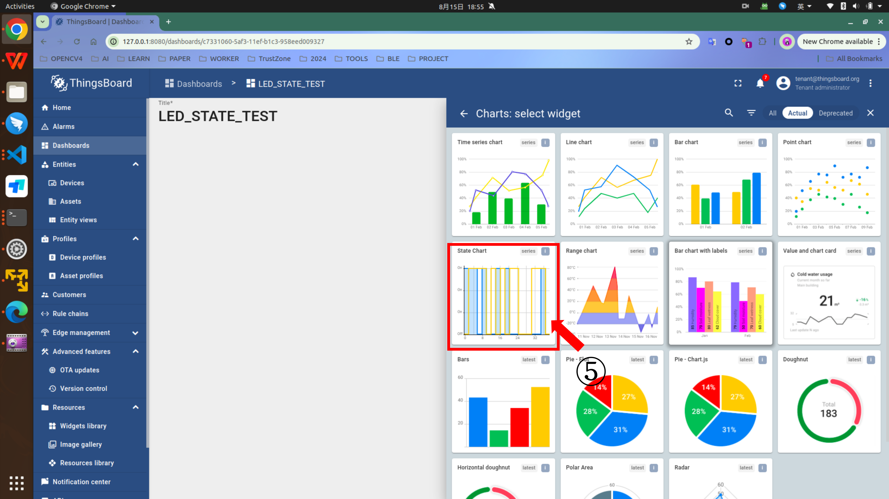

## 实验四： 设备与云平台：基于MQTT的ThingsBoards物联网设备管理
ThingsBoard是用于数据收集、处理、可视化和设备管理的开源物联网平台。它通过行业标准的物联网协议：MQTT、CoAP、SNMP、LWM2M、Modbus、OPC UA和HTTP实现设备连接并支持私有云和本地部署；ThingsBoard具有弹性伸缩、高容错性和性能极致的特点保证永远不会丢失数据。本次实验采取MQTT的方式实现ESP32连接ThingsBoard平台。需要在电脑端完成ThingsBoard的安装和配置，实现ESP32连接平台并数据上传。

### 实验目标:

- 理解MQTT协议，包结构。
- 学会使用ThingsBoards平台包括不限于数据图形化以及规则引擎。
- 实现物联网设备数据(设备原始数据、设备预测状态结果)定期上传。
- 保留NIMBLE GATT服务器，且额外可控制数据上云频率。


### 一、ThingsBoard平台搭建

[ThingsBoard官方](http://www.ithingsboard.com/docs/)提供了社区版、专业版和云服务这三种平台类型，支持Linux、树梅派3、win10等系统，并给出了详细的文档可供学习。ThingsBoard目前支持Ubuntu 18.04 和 Ubuntu 20.04(Ubuntu 22.04经测试也可以)。详细文档可参考[官网教程](http://www.ithingsboard.com/docs/user-guide/install/ubuntu/)。
本次安装ThingsBoard社区版本，给出ubuntu系统的安装教程, 包括容器和本地两种安装方式。

#### (1) 基于Docker的ThingsBoard安装 (**推荐**)

docker 安装前面[RIOT安装环境](./README.md)里面就有提到过，官方已经提供了一个可直接使用的ThingsBoard镜像。使用容器版的ThingsBoard教程可参考[官方文档](http://www.ithingsboard.com/docs/getting-started-guides/helloworld/)。

```bash
mkdir -p ~/.mytb-data && sudo chown -R 799:799 ~/.mytb-data
mkdir -p ~/.mytb-logs && sudo chown -R 799:799 ~/.mytb-logs
sudo docker run -it -p 8080:9090 -p 7070:7070 -p 1883:1883 \
    -p 5683-5688:5683-5688/udp -v ~/.mytb-data:/data \
    -v ~/.mytb-logs:/var/log/thingsboard \
    --name mytb --restart always \
    thingsboard/tb-postgres
```
你可以通过ThingsBoard页面地址http://localhost:8080、 用户名tenant@thingsboard.org和密码tenant进行访问， 有关模拟帐户请参见[此处](http://www.ithingsboard.com/docs/samples/demo-account/)。如何之前mosquitto占用了1883端口，可关闭mosquitto，或者将上述-p 1883:1883 改成你自定义的端口如 -p 11883:1883，先运行下面删除容器，然后再重新运行上述指令。

```bash
sudo docker rm -vf mytb
```

#### (2) 本地安装 (**不推荐**)

1. 输入以下指令，完成java11的安装

```bash
sudo apt update
sudo apt install -y openjdk-11-jdk
sudo update-alternatives --config java
java --version
```

输出以下，java11安装成功。

> openjdk version "11.0.xx"  
OpenJDK Runtime Environment (...)  
OpenJDK 64-Bit Server VM (build ...)  

2. 安装ThingsBoard服务

```bash
cd ~
mkdir ThingsBoard
cd ThingsBoard
sudo apt install -y wget
wget https://github.com/thingsboard/thingsboard/releases/download/v3.5.1/thingsboard-3.5.1.deb
sudo dpkg -i thingsboard-3.5.1.deb
```

3. 配置数据库

直接安装PostgreSQL最为便利。

```bash
# install **wget** if not already installed:
sudo apt install -y wget lsb-release nano

# import the repository signing key:
wget --quiet -O - https://www.postgresql.org/media/keys/ACCC4CF8.asc | sudo apt-key add -

# add repository contents to your system:
RELEASE=$(lsb_release -cs)
echo "deb http://apt.postgresql.org/pub/repos/apt/ ${RELEASE}"-pgdg main | sudo tee  /etc/apt/sources.list.d/pgdg.list

# install and launch the postgresql service:
sudo apt update
sudo apt -y install postgresql-12
sudo service postgresql start
```

为数据库用户设置密码。

```bash
sudo su - postgres
psql
\password
# 需要你输入密码
\q
# 退出
```

连接到数据库创建ThingsBoard数据库，并配置数据库。
```bash
psql -U postgres -d postgres -h 127.0.0.1 -W
# 需要输入密码
CREATE DATABASE thingsboard;
\q
# 按“Ctrl+D”返回控制台
sudo nano /etc/thingsboard/conf/thingsboard.conf
```

将下面内容添加到配置文件中并**替换“PUT_YOUR_POSTGRESQL_PASSWORD_HERE”为postgres帐户密码**：然后CTRL+X， 确认保存Y，最后回车即可退出nano。

```bash
# DB Configuration 
export DATABASE_TS_TYPE=sql
export SPRING_DATASOURCE_URL=jdbc:postgresql://localhost:5432/thingsboard
export SPRING_DATASOURCE_USERNAME=postgres
export SPRING_DATASOURCE_PASSWORD=PUT_YOUR_POSTGRESQL_PASSWORD_HERE
# Specify partitioning size for timestamp 
# key-value storage. Allowed values: DAYS, MONTHS, YEARS, INDEFINITE.
export SQL_POSTGRES_TS_KV_PARTITIONING=MONTHS
```

4. 运行安装脚本
执行以下脚本安装ThingsBoard服务并初始化演示数据：
```bash
# --loadDemo option will load demo data: users, devices, assets, rules, widgets.
cd ~
sudo /usr/share/thingsboard/bin/install/install.sh --loadDemo
```
出现以下内容，即完成ThingsBoard服务安装和初始化:
> ......  
Loading demo data...  
Installation finished successfully!  
ThingsBoard installed successfully!  

5. 启动服务

```bash
sudo service thingsboard start
```

打开浏览器，访问http://localhost:8080/, 
如果在安装脚本的执行过程中指定了-loadDemo则可以使用以下默认帐号:
- System Administrator: sysadmin@thingsboard.org / sysadmin
- Tenant Administrator: tenant@thingsboard.org / tenant
- Customer User: customer@thingsboard.org / customer

#### 注意:如果是wsl2虚拟机的同学，在执行第5步如果出现无法找到服务，请按下面指令执行。
(1) 命令行
```
bash
sudo -u thingsboard /usr/share/thingsboard/bin/thingsboard.jar
```
(2) service服务
```bash
sudo bash
cd /etc/init.d/
wget https://gitee.com/emnets/emnets_experiment/releases/download/thingsboard/thingsboard
sudo chmod +x /etc/init.d/thingsboard
sudo service thingsboard start
sudo service thingsboard status
# 开机自启动
sudo update-rc.d thingsboard defaults
cd /etc/rc3.d
sudo ln -s ../init.d/thingsboard S01thingsboard

# 取消开机自启动
sudo update-rc.d -f thingsboard remove

# init.d指令请参考下面。
# 启动服务
sudo service thingsboard start
# 停止服务
sudo service thingsboard stop
# 重启服务
sudo service thingsboard restart
# 查看服务状态
sudo service thingsboard status
```

### 二、ThingsBoard 使用
打开浏览器，访问http://localhost:8080/, 输入Tenant Administrator默认账户其中一个即可。
可以使用以下默认帐号:
- System Administrator: sysadmin@thingsboard.org / sysadmin
- Tenant Administrator: tenant@thingsboard.org / tenant
- Customer User: customer@thingsboard.org / customer
> 如果本地无法搭建，可使用http://10.214.131.103:8080/.
<div style="text-align: center;">
  <figure>
    
    <figcaption>登陆页面</figcaption>
  </figure>
</div>

1. 登录并打开设备页面
2. 单击Entities
3. 单击Devices
4. 点击+，并点击Add new device

<div style="text-align: center;">
  <figure>
    
    <figcaption>设备主页</figcaption>
  </figure>
</div>

以下操作是添加设备，里面的信息都是自己定义，需要记住，后续要使用。  
1. 填写Name，这里demo可输入esp32
2. 填写Label
3. 点击Next: Credentials
4. 点击MQTT Basic
5. 填写ClientID
6. 填写User Name
7. 填写Password
8. 完成添加  

<div style="text-align: center;">
  <figure>
    
    <figcaption>设备添加</figcaption>
  </figure>
</div>

完成上述操作，可显示以下窗口，可先用本地电脑尝试下连接。

<div style="text-align: center;">
  <figure>
    
    <figcaption>连接检测</figcaption>
  </figure>
</div>

### 三、ThingsBoard 连通测试
主机命令行安装mosquitto客户端，进行连通测试
```bash
sudo apt-get install curl mosquitto-clients
mosquitto_pub -d -q 1 -h localhost -p 1883 -t v1/devices/me/telemetry -i "esp32_test" -u "esp32" -P "esp32" -m "{temperature:25}"
```
- -d: 显示日志
- -q: Quality of service level
- -h: 主机IP, 如果是其他设备访问，需要更改为真实的IP(如`10.214.131.103`)
- -p: MQTT 端口，这里默认是1883
- -t: mqtt topic to publish to, 比如v1/devices/me/telemetry, v1/devices/me/attributes
- -i：前面定义的Client ID
- -u:  前面定义的User Name
- -P：前面定义的密码Password
- -m: 要发的信息

完成发送后，命令行会显示, 且刚才那个窗口会显示temperature 信息

> Client esp32_test sending CONNECT  
Client esp32_test received CONNACK (0)  
Client esp32_test sending PUBLISH (d0, q1, r0, m1, 'v1/devices/me/telemetry', ... (16 bytes))  
Client esp32_test received PUBACK (Mid: 1, RC:0)  
Client esp32_test sending DISCONNECT  

### 四、ESP32连接ThingsBoard官网案例
#### 4.0 Makefile
```bash
GNRC_IPV6 ?= 0
LWIP_IPV4 ?= 1
LWIP_IPV6 ?= 0
WIFI_SSID ?= "xxx"
WIFI_PASS ?= "xxxxxxxx"
```
Makefile 需要注意 `GNRC_IPV6`设置为0(默认的GNRC库不支持IPV4)，`LWIP_IPV4`设置为1， 需要修改`WIFI_SSID`wifi名和 `WIFI_PASS`wifi密码(建议连接在校园网内的手机或者电脑开个热点，上面信息填写对应的热点信息)。

#### 4.1 代码介绍
(1) 头文件
```c++
// 30_mqtt_thingsboard/main.cpp
#include "paho_mqtt.h"
#include "MQTTClient.h"
```
`paho_mqtt.h`为开源项目paho_matt的头文件，`MQTTClient.h`为RIOS OS 对接paho_mqtt项目实现的头文件。

(2) 主体内容
```c++
// 30_mqtt_thingsboard/main.cpp
string DEFAULT_MQTT_CLIENT_ID = "esp32_test";
string DEFAULT_MQTT_USER = "esp32";
string DEFAULT_MQTT_PWD = "esp32";
// Please enter the IP of the computer on which you have ThingsBoard installed.
// (主机IP),不要使用虚拟机IP。
string DEFAULT_IPV4 = "x.x.x.x";
string DEFAULT_TOPIC = "v1/devices/me/telemetry";
```
1) 以上几个参数除了`DEFAULT_IPV4`, 其余都和上面Thingsboard搭建，创建的设备有关，对应填写即可,`DEFAULT_IPV4`需要修改为Thingsboard物联网平台搭建的电脑`IP`,需要确保ESP32连接的网络能访问云平台的IP。
```c++
// 30_mqtt_thingsboard/main.cpp
#define DEFAULT_MQTT_PORT               1883
#define DEFAULT_KEEPALIVE_SEC           10
#ifndef MAX_LEN_TOPIC
#define MAX_LEN_TOPIC                   100
#endif
#ifndef MAX_TOPICS
#define MAX_TOPICS                      4
#endif
#define IS_CLEAN_SESSION                1
#define IS_RETAINED_MSG                 0
```
2) 需要留意`DEFAULT_MQTT_PORT`, 1883是默认的MQTT服务器端口，正常不用改。其余默认即可。
```c++
// 30_mqtt_thingsboard/main.cpp
static MQTTClient client;
static Network network;
static int topic_cnt = 0;
static char _topic_to_subscribe[MAX_TOPICS][MAX_LEN_TOPIC];
static unsigned char buf[BUF_SIZE];
static unsigned char readbuf[BUF_SIZE];
#define BUF_SIZE                        1024

int main(void)
{
    NetworkInit(&network);
    MQTTClientInit(&client, &network, COMMAND_TIMEOUT_MS, buf, BUF_SIZE,
                   readbuf,
                   BUF_SIZE);
    MQTTStartTask(&client);   
}

```
3) 
- `NetworkInit`此函数用于初始化网 络对象 `network`。在 MQTT 客户端通信中，`network` 负责处理与底层网络堆栈（例如 TCP/IP）的交互。`NetworkInit` 函数通常会配置网络连接所需的参数和资源。
- `MQTTClientInit`: 这个函数用于初始化 MQTT 客户端 client。它将客户端与已初始化的网络对象 network 关联，配置超时时间 COMMAND_TIMEOUT_MS 以及用于发送和接收数据的缓冲区（buf 和 readbuf）。这些缓冲区的大小由 BUF_SIZE 决定。该函数还会初始化客户端所需的各种资源。
- `MQTTStartTask`: 此函数启动一个 MQTT 任务，使其能够处理消息的收发和处理。这个任务通常是独立运行的线程或任务，它会持续运行，确保客户端在后台处理 MQTT 协议的相关操作（如接收消息、发送心跳等）。

网络DHCP IP分配需要一定的时间。

```c++
// 30_mqtt_thingsboard/main.cpp

int mqtt_disconnect(void)
{
    topic_cnt = 0;
    int res = MQTTDisconnect(&client);
    if (res < 0) {
        printf("mqtt_example: Unable to disconnect\n");
    }
    else {
        printf("mqtt_example: Disconnect successful\n");
    }

    NetworkDisconnect(&network);
    return res;
}

int mqtt_connect(void)
{
    const char *remote_ip;
    remote_ip = DEFAULT_IPV4.c_str();
    if (client.isconnected) {
        printf("mqtt_example: client already connected, disconnecting it\n");
        MQTTDisconnect(&client);
        NetworkDisconnect(&network);
    }
    int port = DEFAULT_MQTT_PORT;

    MQTTPacket_connectData data = MQTTPacket_connectData_initializer;
    data.MQTTVersion = MQTT_VERSION_v311;

    data.clientID.cstring = (char *)DEFAULT_MQTT_CLIENT_ID.c_str();
    data.username.cstring = (char *)DEFAULT_MQTT_USER.c_str();
    data.password.cstring = (char *)DEFAULT_MQTT_PWD.c_str();
    data.keepAliveInterval = DEFAULT_KEEPALIVE_SEC;
    data.cleansession = IS_CLEAN_SESSION;
    data.willFlag = 0;

    NetworkConnect(&network, (char *)remote_ip, port);
    int ret = MQTTConnect(&client, &data);
    if (ret < 0) {
        printf("mqtt_example: Unable to connect client %d\n", ret);
        mqtt_disconnect();
        return ret;
    }
    else {
        printf("mqtt_example: Connection successfully\n");
    }

    return (ret > 0) ? 0 : 1;
}
int mqtt_pub(void)
{
    enum QoS qos = QOS0;

    MQTTMessage message;
    message.qos = qos;
    message.retained = IS_RETAINED_MSG;
    led_state = !led_state;
    char json[100];  
    snprintf(json, 100, "{r_led_state:%d}", led_state);
    printf("[Send] Message:%s\n", json);
    message.payload = json;
    message.payloadlen = strlen((char *)message.payload);

    int rc;
    if ((rc = MQTTPublish(&client, DEFAULT_TOPIC.c_str(), &message)) < 0) {
        printf("mqtt_example: Unable to publish (%d)\n", rc);
    }
    else {
        printf("mqtt_example: Message (%s) has been published to topic %s"
               "with QOS %d\n",
               (char *)message.payload, DEFAULT_TOPIC.c_str(), (int)message.qos);
    }

    return rc;
}

void send(void)
{
    mqtt_connect();
    mqtt_pub();
    mqtt_disconnect();
}
```
4) `mqtt_connect`, `mqtt_disconnect`, `mqtt_pub`, 看函数名即可理解(连接、断开连接、发布信息)。注意最好每次保证**连接---一次发布---断开连接**的形式(如`send`函数)。目前经测试，thingsboard MQTT订阅存在较大问题，只能响应共享属性服务器端主动修改的信息，因此本实验不涉及订阅操作，有兴趣的同学可自行研究`MQTTUnsubscribe`（可自行搭建一个mosquitto MQTT服务器，不做要求）。可以注意到`mqtt_pub`上传的数据是`{r_led_state:%d}`;


```bash
#  30_mqtt_thingsboard/makefile
USEMODULE += shell_cmds_default
```
```c++
// 30_mqtt_thingsboard/main.cpp
// cmd 终端指令
static int _cmd_send(int argc, char **argv)
{
    (void) argc;
    (void) argv;

    for (int i = 0; i < 10; ++i)
    {
        msg_t msg;
        msg.type = led_state == 0 ? LED_MSG_TYPE_NONE : LED_MSG_TYPE_RED;
        if (msg_send(&msg, _led_pid) <= 0){
            printf("[_cmd_send]: possibly lost interrupt.\n");
        }
        else{
            printf("[_cmd_send]: Successfully set interrupt.\n");
        }
        mqtt_connect();
        mqtt_pub();
        mqtt_disconnect();
        delay_ms(2000);
    }
    return 0;
}
static const shell_command_t shell_commands[] =
{
    {  "send",  "send data",                          _cmd_send },
    { NULL,     NULL,                                 NULL        }
};
int main(){
    // ...
    char line_buf[SHELL_DEFAULT_BUFSIZE];
    shell_run(shell_commands, line_buf, SHELL_DEFAULT_BUFSIZE);

}
```
5) 自定义终端操作, 这个了解即可，最终不做要求。`_cmd_send`支持终端输入(每2s通知LED线程改变灯状态，并且通过pub数据上传)，并在`shell_commands`指明操作指令**send**，以及帮助信息**send data**,之后在主函数，运行`shell_run`即可开启终端操作。(在`Makefile`里添加模块`shell_cmds_default`)
- `shell_run`: 提供了终端操作的一些指令。本案例，在运行时，输入`help`,会得到下面类似的内容。可以看到`send`命令可在终端使用。
> 2024-08-15 17:31:23,696 # help  
> 2024-08-15 17:31:23,699 # Command              Description  
> 2024-08-15 17:31:23,701 # ---------------------------------------  
> 2024-08-15 17:31:23,704 # sub                  subscribe topic  
> 2024-08-15 17:31:23,707 # unsub                unsubscribe from topic  
> 2024-08-15 17:31:23,710 # send                 send data  
> 2024-08-15 17:31:23,715 # ifconfig             List network interfaces  
> 2024-08-15 17:31:23,720 # pm                   interact with layered PM subsystem  
> 2024-08-15 17:31:23,726 # ps                   Prints information about running threads.  
> 2024-08-15 17:31:23,729 # reboot               Reboot the node  
> 2024-08-15 17:31:23,732 # version              Prints current RIOT_VERSION  


#### 4.2 运行案例
按照上面要去，修改平台IP`DEFAULT_IPV4`(main.cpp)和WIFI_SSID,WIFI_PASS(Makefile)内容。(WIFI只能是2.4GHz频段的)
```bash
cd ~/RIOT/examples/emnets_experiment/30_mqtt_thingsboard
# sudo chmod 777 /dev/ttyUSB*
esp_idf all
make BOARD=esp32-wroom-32 LWIP_IPV4=1 GNRC_IPV6=0 \
 WIFI_SSID="WIFI账户" WIFI_PASS="WIFI密码" \
 flash term
 
# 基于容器的方法(esp32工具链)
BUILD_IN_DOCKER=1 DOCKER="sudo docker" \
DOCKER_IMAGE=schorcht/riotbuild_esp32_espressif_gcc_8.4.0 \
make BOARD=esp32-wroom-32 LWIP_IPV4=1 GNRC_IPV6=0 \
    WIFI_SSID="WIFI账户" WIFI_PASS="WIFI密码" \
    flash term
```

esp32 终端最终会打印类似以下的信息。
> 2024-08-15 17:30:33,625 # main(): This is RIOT! (Version: 2024.10-devel-39-g340caa)  
> 2024-08-15 17:30:33,635 # Running mqtt paho example. Type help for commands info  
> 2024-08-15 17:30:33,648 # LED Controller initialized with (RGB: GPIO26, GPIO25, GPIO27)  
> 2024-08-15 17:30:33,650 # [MAIN] LED_PID: 9  
> 2024-08-15 17:30:33,653 # [LED_THREAD] main Sender_PID: 4  
> 2024-08-15 17:30:33,655 # [LED_THREAD] WAIT  
> 2024-08-15 17:30:33,658 # [main]: Successfully set interrupt.  
> 2024-08-15 17:30:33,661 # mqtt_example: Unable to connect client -1  
> 2024-08-15 17:30:33,663 # mqtt_example: Unable to disconnect  
> 2024-08-15 17:30:35,165 # mqtt_example: Unable to connect client -1  
> 2024-08-15 17:30:35,167 # mqtt_example: Unable to disconnect  
> 2024-08-15 17:30:35,743 # WiFi connected to ssid EmNets-301, channel 1  
> ...   
> 2024-08-15 17:30:41,184 # mqtt_example: Unable to disconnect  
> 2024-08-15 17:30:42,684 # mqtt_example: Unable to connect client -1  
> 2024-08-15 17:30:42,686 # mqtt_example: Unable to disconnect  
> 2024-08-15 17:30:44,426 # mqtt_example: Connection successfully  
> 2024-08-15 17:30:44,428 # mqtt_example: Disconnect successful  

注意到，程序在`2024-08-15 17:30:35,743`成功连接WIFI，但是此时还没分配IP，因此，此时想连接MQTT服务器，mqtt提示无法连接；到`2024-08-15 17:30:44,426`提示成功连接，说明此时分配好IP了。
输入`ifconfig`，查看是否获得IP  
> 2024-04-02 12:38:41,591 # WiFi connected to ssid EmNets-301, channel 1  
> ifconfig    
> 2024-08-15 17:53:18,848 # ifconfig  
> 2024-08-15 17:53:18,853 # Iface ET0 HWaddr: 88:13:bf:0c:12:58 Link: up State: up  
> 2024-08-15 17:53:18,855 #         Link type: wireless  
> 2024-08-15 17:53:18,859 #         inet addr: 192.168.31.5 mask: 255.255.255.0 gw: 192.168.31.1  

输入`send`， 发送数据。
> 2024-08-15 17:55:02,225 # [LED_THREAD] Sender_PID: 4  
2024-08-15 17:55:02,227 # [LED_THREAD]: LED TURN ON!!  
2024-08-15 17:55:02,230 # [LED_THREAD] WAIT  
2024-08-15 17:55:02,232 # [_cmd_send]: Successfully set interrupt.  
2024-08-15 17:55:02,305 # mqtt_example: Connection successfully  
2024-08-15 17:55:02,307 # [Send] Message:{r_led_state:0}  
2024-08-15 17:55:02,316 # mqtt_example: Message ({r_led_state:0}) has been published to topic v1/devices/me/telemetrywith QOS 0  
2024-08-15 17:55:02,317 # mqtt_example: Disconnect successful  
...  


平台也显示刚刚发送的信息。到这里，案例就可以结束了。如果一直持续报错`mqtt_example: Unable to connect client -1 `，无法执行send(), 那么请参考[错误解答](#七错误解答)的第4点和第5点。

#### 4.3 可视化
接下来，将结合上面案例，实现数据可视化。按照图片操作即可。如何你的ThingsBoard页面和下面的不一样，那么请直接下载并自行浏览[补充材料-可视化](https://gitee.com/emnets/emnets_experiment/releases/download/material/thingsboard%E5%8F%AF%E8%A7%86%E5%8C%96.pdf)。





之后，在刚才设备运行时候，命令行输入`send`发布信息。结果类似下面视频。


#### 4.4 添加规则引擎
规则引擎内容比较多，请直接下载并自行浏览[补充材料-规则引擎](https://gitee.com/emnets/emnets_experiment/releases/download/material/ThingsBoard%E8%A7%84%E5%88%99%E5%BC%95%E6%93%8E.pdf)。

### 五、正式实验: 设备数据上云且可视化展示
该环节代码处于`31_mqtt_thingsboard_experiment`,通过前面案例，想必你们已经学会如何使用MQTT将数据上传到Thingsboard云平台以及可视化显示。本实验需要在之前的所有实验基础上，实现以下具体功能:
1) 前面实验要求，请查看实验三的报告。
2) 每隔mqtt_interval_ms(如，默认5s)，数据(MPU6050传感器最近一次数据，设备最近一次姿态识别结果，LED灯当前R,G,B状态)数据上云
3) 在第二点要求下，三个可视化: 一: 6轴数据， 二: 设备姿态，三: LED灯R，G，B状态。
4) NIMBLE GATT服务器原先功能不变，添加修改和读取mqtt_interval_ms的功能(用户可读取，修改设备上云时间间隔)。
5) 加分点: 添加规则引擎，(1) 根据R,G,B生成一个RGB代码如(FF0000), (2) 设备处于倾斜状态，触发警告，等其他功能。

完成上述内容后，请撰写实验报告，请录制结果视频，在截至时间前，在**学在浙大**上，上传报告。
#### 注意
该实验是最后一个实验，与全部实验挂钩，后续可能需要涉及线下展示，在整个实验占大比分，请保持随时能复刻你实验结果的状态。

(1) 没有路由器的同学，建议手机开热点(热点的频段为2.4GHz, 不开流量，手机可以连接校园网)，电脑和设备都连接手机的热点。
(2) Windows 电脑开放端口1883, 具体怎么开放端口，请参考[端口开放](https://blog.csdn.net/m0_43605481/article/details/119255256)。
(3) VMWARE虚拟机或者virtual box 虚拟机以及wsl都需要设置一下端口转发1883端口。

1) vmware虚拟机(留意端口好，其余虚拟机IP以你虚拟机网关分配为主)

虚拟机vmware `ifconfig`指令如果无法获取虚拟机网卡IP，可执行下面指令:
```bash
sudo -i
dhclient -v
ifconfig
```

2) virtual box虚拟机


3) wsl2, 请参考该文章[开放端口](https://zhuanlan.zhihu.com/p/425312804)和[端口转发](https://blog.csdn.net/keyiis_sh/article/details/113819244)(端口转发请看这个，另外一个可能存在问题)，开放并转发1883端口。
```bash
# netsh interface portproxy add v4tov4 listenport=[win10端口] listenaddress=0.0.0.0 connectport=[虚拟机的端口] connectaddress=[虚拟机的ip]
# 主机powershell里面执行
netsh interface portproxy add v4tov4 listenport=1883 listenaddress=0.0.0.0 connectport=1883 connectaddress=虚拟机IP
# 虚拟机里面通过ifconfig 查看ipv4最后一段不是1的IP。
```

(4) 最后，ESP32里面的MQTT服务器IP请使用主机IP，不是虚拟机IP，请保证主机和ESP32在同一个网段下。

### 六、代码更新
老版本等待IP分配，是查看是否能成功MQTT连接，这边会导致一些问题。（不改其实大概率也没有问题。）
这里说明一下旧代码如何修改。只需要修改`main.cpp`文件。
首先加入头文件`#include "lwip/netif.h"`, 其次将下面代码
```c++
// waiting for get IP 
while(mqtt_connect() < 0)
{
    delay_ms(1500);
}
mqtt_disconnect();
```
改成下面代码即可。
```c++
// main.cpp
// waiting for get IP 
extern struct netif *netif_default;
uint32_t addr;
do
{
    addr = netif_ip_addr4(netif_default)->addr;
    printf("Waiting for getting IP, current IP addr:");
    ip_addr_debug_print(LWIP_DBG_ON, netif_ip_addr4(netif_default));
    printf("\n");
    delay_ms(1000);
}while (addr == 0x0);    

```

### 七、错误解答
1) 出现下面问题，请将`external_modules/gesture/main_functions.cc`的参数`kTensorArenaSize`改小。

> 2024-10-02 19:02:41,951 # Bluetooth controller initialize failed: 2570x0 => FAILED ASSERTION.  

或者


2) 出现下面问题，请在`main.cpp`主函数里面在IMU线程创建前，执行`setup();`完成模型初始化。如果添加`setup();`仍然出现下面问题,请请将`external_modules/gesture/main_functions.cc`的参数`kTensorArenaSize`改小。
如果调小仍然没有，需要考虑变小模型或者根据实际情况，适当调小线程栈，比如下面led线程分配了2048byte的线程栈，实际上只用了704byte，可以考虑调小LED线程栈。
> 2024-10-02 19:06:07,645 # EXCEPTION!! exccause=28 (LoadProhibitedCause) @800e06f5 excvaddr=00000000  
> 2024-10-02 19:06:07,645 # processes:  
> 2024-10-02 19:06:07,654 #       pid | name                 | state    Q | pri | stack  ( used) ( free) | base addr  | current      
> 2024-10-02 19:06:07,662 #         1 | sys_evt              | bl mutex _ |   4 |   2616 ( 1184) ( 1432) | 0x3ffb7578 | 0x3ffb7d60  
> 2024-10-02 19:06:07,672 #         2 | esp_timer            | sleeping _ |   2 |   3640 (  468) ( 3172) | 0x3ffba6ac | 0x3ffbb310  
> 2024-10-02 19:06:07,680 #         3 | idle                 | pending  Q |  31 |   2048 (  452) ( 1596) | 0x3ffc31b4 | 0x3ffc37f0  
> 2024-10-02 19:06:07,689 #         4 | main                 | bl mutex _ |  15 |   3584 ( 1556) ( 2028) | 0x3ffc39b4 | 0x3ffc4550  
> 2024-10-02 19:06:07,697 #         5 | wifi                 | bl mutex _ |   1 |   6200 ( 1340) ( 4860) | 0x3ffbc194 | 0x3ffbd790  
> 2024-10-02 19:06:07,705 #         6 | lwip_netdev_mux      | bl anyfl _ |  11 |   2048 (  516) ( 1532) | 0x3ffc8f34 | 0x3ffc9530  
> 2024-10-02 19:06:07,714 #         7 | tcpip_thread         | bl mbox  _ |   5 |   2048 (  628) ( 1420) | 0x3ffc6814 | 0x3ffc6da0  
> 2024-10-02 19:06:07,722 #         8 | btController         | bl mutex _ |   1 |   3640 ( 1956) ( 1684) | 0x3ffd98dc | 0x3ffda4d0  
> 2024-10-02 19:06:07,731 #         9 | nimble_host          | bl anyfl _ |  13 |   2048 ( 1644) (  404) | 0x3ffca2cc | 0x3ffca8b0  
> 2024-10-02 19:06:07,739 #        10 | paho_mqtt_riot       | bl mutex _ |  14 |   4096 (  644) ( 3452) | 0x3ffc2134 | 0x3ffc2f30  
> 2024-10-02 19:06:07,747 #        11 | led                  | bl rx    _ |  13 |   2048 (  704) ( 1344) | 0x3ffc1880 | 0x3ffc1e90  
> 2024-10-02 19:06:07,756 #        12 | motion_predict_thread| running  Q |  13 |   2048 ( 1440) (  608) | 0x3ffc1080 | 0x3ffc14b0  
> 2024-10-02 19:06:07,764 #           | SUM                  |            |     |  36064 (12532) (23532)  
> 2024-10-02 19:06:07,764 #  
> 2024-10-02 19:06:07,767 # heap: 74152 (used 51352, free 22800) [bytes]  
> 2024-10-02 19:06:07,767 #  
> 2024-10-02 19:06:07,769 # register set  
> 2024-10-02 19:06:07,775 # pc      : 400f219b    ps      : 00060130      exccause: 0000001c      excvaddr: 00000000  
> 2024-10-02 19:06:07,778 # epc1    : 400f219b  
> 2024-10-02 19:06:07,783 # a0      : 800e06f5    a1      : 3ffc1610      a2      : 00000000      a3      : 00000000  
> 2024-10-02 19:06:07,791 # a4      : 00000000    a5      : 3ffc1626      a6      : 3ffc1624      a7      : 3ffc1622  
> 2024-10-02 19:06:07,797 # a8      : 00000000    a9      : 00000000      a10     : 000000fa      a11     : 0000003b  
> 2024-10-02 19:06:07,803 # a12     : 0000000e    a13     : 3ffc1632      a14     : 000e24cc      a15     : 00000000  

3) 如果出现类似下面的stackflow错误，请将对应的报错的线程的线程栈空间变大。比如下面motion_predict_thread原始栈空间是2048, 可将之改大，改大后如果会出现问题1，那么接着改小`kTensorArenaSize`。


4) 如果在30_mqtt_thinsboard实验中类似下面问题，持续报错，请参考[注意](#注意), 检测是否转发并开放端口、主机和ESP32是否同一网段、是否用主机IP（不要用虚拟机IP）。


5) 如果持续报下面错误（如果报错一会之后就不再报错可以不用在意），请参考[代码更新](#六代码更新)，完成代码更新。


6) 如果出现下面问题，请执行下面指令:
```bash
cd ~/RIOT/examples
cp emnets_experiment/lwip_netif.c ../sys/shell/cmds/lwip_netif.c
```

### ACKNOWLEDGMENTS
特别感谢方同学在WIFI连接上提供的帮助, 赵同学关于VMWARE虚拟机获取网卡IP上的帮助。同时，鼓励其他同学在遇到并解决类似问题后，积极联系助教，分享自己的解决方案，共同促进学习社区的进步。